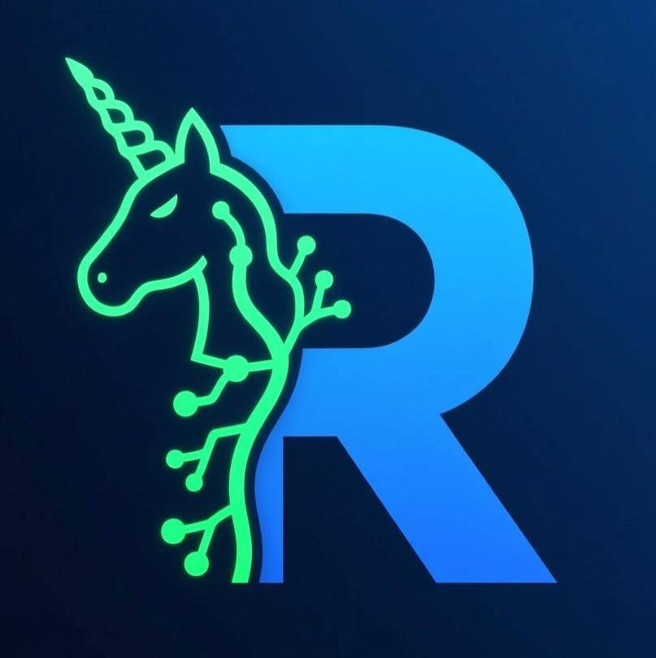
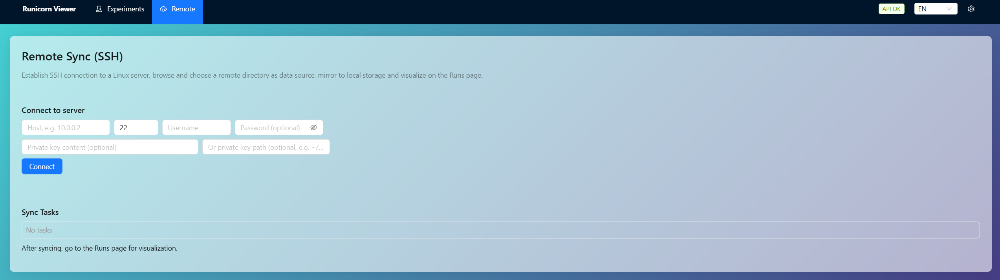

# Runicorn

**English** | [简体中文](README_zh.md)

[](https://pypi.org/project/runicorn/)
[](https://pypi.org/project/runicorn/)
[](LICENSE)

<p align="center">
  
</p>

Local, open-source experiment tracking and visualization. 100% offline. Lightweight and zero-intrusion; a self-hosted alternative to W&B.

- Package name: `runicorn`
- Viewer: read-only; reads metrics/logs from local storage; supports overlaying charts across multiple experiments
- Remote SSH live sync: mirror runs from a Linux server to your local storage in real time
- GPU panel: shown if `nvidia-smi` is available


<p align="center">
  
  
  <br/>
  
  
  <br/>
  
  <br/>
  <span style="color:#888; font-size: 12px;">UI overview: run list, run details, metrics overlay, GPU panel</span>
  
</p>

Features
--------
- 100% local; data stays on your machine
- Read-only viewer (FastAPI); zero intrusion to your training process
- UI assets bundled in the wheel; available offline after install
- Supports step/time dual x-axes, stage separators (stage), and live logs (WebSocket)
- Optional GPU panel (requires `nvidia-smi`)
- Per-user root directory with project/experiment hierarchy
- Overlay multiple runs of the same experiment on a single chart


Installation
------------
Requires Python 3.8+ (Windows/Linux). The desktop app is currently Windows-only; the CLI/Viewer work on both Windows and Linux.

```bash
pip install -U runicorn
```

Quick start
-----------------

### Start the viewer

```bash
runicorn viewer
# or custom params
runicorn viewer --host 127.0.0.1 --port 8000
# Open http://127.0.0.1:8000
```

Recommended: if you have Runicorn Desktop installed, just double-click to launch.

### Set the local storage root

- In Desktop app UI: top-right gear → Settings → Data Directory → Save Data Directory.

- Via CLI:

```bash
runicorn config --set-user-root "E:\\RunicornData"
runicorn config --show
```

The setting is written to `%APPDATA%\Runicorn\config.json` and can be edited directly.

### Usage example

```python
import runicorn as rn
import math, random

# Specify project and experiment names; by default it writes under the per-user root
run = rn.init(project="demo", name="exp1")

stages = ["warmup", "train"]
for i in range(1, 101):
    stage = stages[min((i - 1) // 50, len(stages) - 1)]
    loss = max(0.02, 2.0 * math.exp(-0.02 * i) + random.uniform(-0.02, 0.02))
    rn.log({"loss": round(loss, 4)}, stage=stage)

rn.summary({"best_val_acc_top1": 77.3})
rn.finish()
```

Optional: explicitly override the storage root

```python
run = rn.init(project="demo", name="exp1", storage="E:\\RunicornData")
```

Storage root precedence (high → low):

1. `runicorn.init(storage=...)`
2. Environment variable `RUNICORN_DIR`
3. Per-user config `user_root_dir` (set via `runicorn config`)

Remote
----------------------
Mirror runs from a remote Linux server to your local storage over SSH in real time.

- Open the top navigation "Remote" page
- Steps:
  1) Connect: enter `host`, `port` (default 22), `username`; optionally enter `password` or `private key` content/path.
  2) Browse remote directories and select the correct level:
     - For v0.2.0 and above: we recommend selecting the per-user root directory.
  3) Click "Sync this directory". A "Sync Task" appears below, and the "Runs" page refreshes immediately.

Tips & troubleshooting
- If no runs appear, check:
  - Mirror task: GET `/api/ssh/mirror/list` should show `alive: true` with increasing counters.
  - Local storage root: GET `/api/config` to inspect the `storage` path; verify the expected hierarchy is created.
  - Credentials are only used for this session and are not persisted; SSH is handled by Paramiko.

Desktop app (Windows)
---------------------
- Install from GitHub Releases (recommended for end users), or build locally.
- Prerequisites: Node.js 18+; Rust & Cargo (stable); Python 3.8+; NSIS (for installer packaging).
- Build locally (creates an NSIS installer):

  ```powershell
  # From repo root
  powershell -ExecutionPolicy Bypass -File .\desktop\tauri\build_release.ps1 -Bundles nsis
  # Installer output:
  # desktop/tauri/src-tauri/target/release/bundle/nsis/Runicorn Desktop_<version>_x64-setup.exe
  ```

- After installation, launch "Runicorn Desktop".
  - First run: open the gear icon (top-right) → Settings → Data Directory, choose a writable path (e.g., `D:\RunicornData`), then Save.
  - The desktop app auto-starts a local backend and opens the UI.

Privacy & Offline
-----------------
- No telemetry. The viewer only reads local files (JSON/JSONL and media).
- Bundled UI allows using the viewer without Node.js at runtime.

Storage layout
--------------
```
user_root_dir/
  <project>/
    <name>/
      runs/
        <run_id>/
          meta.json
          status.json
          summary.json
          events.jsonl
          logs.txt
          media/
```

Community
---------
- See `CONTRIBUTING.md` for dev setup, style, and release flow.
- See `SECURITY.md` for private vulnerability reporting.
- See `CHANGELOG.md` for version history.

AI
---
This project is mainly developed by OpenAI's GPT-5.
