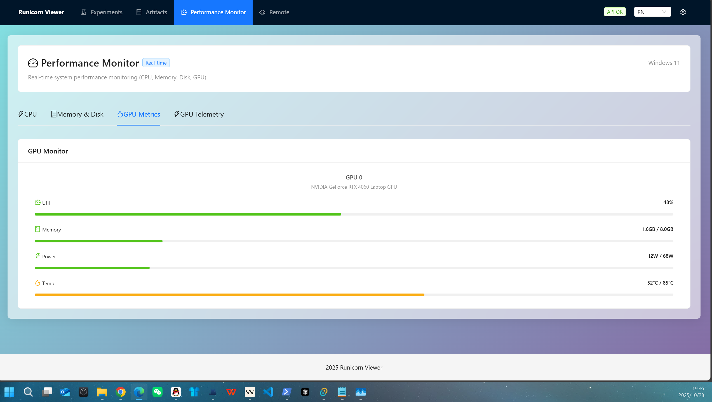

# Runicorn

**English** | [简体中文](README_zh.md)

[](https://pypi.org/project/runicorn/)
[](https://pypi.org/project/runicorn/)
[](LICENSE)

<p align="center">
  
</p>

Local, open-source experiment tracking and visualization. 100% offline. Professional ML experiment management; a modern self-hosted alternative to W&B.

## ✨ What's New

### v0.5.0 (Latest)

**🚀 Major Architecture Upgrade - Remote Viewer**

Runicorn 0.5.0 introduces an all-new **Remote Viewer** feature, adopting a VSCode Remote Development-style architecture that completely transforms how you access remote servers.

**Core Changes**:
- 🌐 **VSCode Remote Architecture** - Run Viewer on remote servers, access via SSH tunnel from local browser
- ⚡ **Real-time Access** - No sync needed, direct access to remote data, latency < 100ms
- 💾 **Zero Local Storage** - No need to mirror remote data locally, save massive disk space
- 🔧 **Auto Environment Detection** - Smart detection of remote Conda/Virtualenv environments, select and use
- 🔒 **Secure Connection** - SSH key/password authentication, automatic port forwarding, all communications encrypted
- 📊 **Full Feature Parity** - All features work identically in remote mode and local mode

**vs Old Remote Sync (0.4.x)**:

| Feature | 0.4.x File Sync | 0.5.0 Remote Viewer |
|---------|-----------------|--------------------|
| Data Transfer | Sync GB-level data | No sync, real-time access |
| Initial Wait | Hours (large datasets) | Seconds (connection startup) |
| Local Storage | Required (mirror copy) | Not required (zero usage) |
| Real-time | 5-10 min delay | Fully real-time (< 100ms) |
| Use Case | Occasional viewing | Daily development |

**Quick Try**:
```bash
runicorn viewer  # Start local Viewer
# Open browser → Click "Remote" → Enter server info → Connect and use!
```

**UI & Quality Improvements**:
- 🎨 **Modern UI Animations** - Framer Motion powered components with configurable animations
- 🖼️ **Brand Identity** - Custom favicon with unicorn logo for better recognition
- 🌐 **Localization Polish** - Refined Chinese translations for better understanding
- 🐧 **WSL Compatibility** - Enhanced CPU monitoring for WSL/WSL2 environments
- 📝 **Persistent Logging** - Rotating log files (~/.runicorn/logs/viewer.log) for diagnostics

→ [Remote Viewer Complete Guide](docs/guides/en/REMOTE_VIEWER_GUIDE.md)

---

<details>
<summary><b>Version History</b></summary>

### v0.4.1

- 🆕 **System Information Panel** - View version, storage, and cache stats in Settings
- 🎨 **Dark Mode Improvements** - Better text readability across all pages
- ⚡ **Stability & Performance** - Optimized resource management and bug fixes

### v0.4.0

- 📦 **Model Versioning** - Complete Artifacts system for models and datasets
- 🔗 **Auto Lineage Tracking** - Track complete dependencies between artifacts and experiments
- 💾 **Smart Deduplication** - Hash-based content dedup, save 50-90% storage
- 🌳 **Lineage Visualization** - Interactive dependency graphs with ECharts
- 🏷️ **Version Aliases** - Semantic versioning (latest, production, etc.)
- 🔐 **Security Enhancements** - Triple-layer path traversal protection
- ⚡ **Performance Boost** - Metrics caching, 10-20x faster API
- 🎨 **UI Improvements** - Unified design system, optimized controls

</details>

## Core Features

- **Python Package**: `runicorn` - Universal SDK for any ML framework
- **Experiment Tracking**: Auto-log metrics, logs, environment info, smart status detection
- **Model Versioning**: Artifacts system - Git-like version control for ML assets
- **Web Viewer**: Modern interface, real-time charts and experiment comparison
- **Remote Viewer** 🆕: VSCode Remote-style architecture, real-time access to remote servers
- **Desktop App**: Native Windows application with auto-backend
- **GPU Monitoring**: Real-time GPU telemetry (requires `nvidia-smi`)


<table>
  <tr>
    <td width="50%"></td>
    <td width="50%"></td>
  </tr>
  <tr>
    <td width="50%"></td>
    <td width="50%"></td>
  </tr>
</table>

<p align="center">
  <span style="color:#888; font-size: 12px;">UI Overview</span>
</p>


Features
--------

### 🏠 **Local & Secure**
- 100% local; data stays on your machine
- Zero telemetry; complete privacy
- Offline-capable after installation

### 🎯 **Smart Experiment Tracking**
- **Universal Best Metric** - Set any metric as primary indicator with auto-tracking
- **Intelligent Status Detection** - Automatic detection of crashed/interrupted experiments
- **Soft Delete & Recycle Bin** - Safe experiment management with restore capability
- **Environment Capture** - Automatic Git, dependencies, and system info tracking

### 📊 **Advanced Visualization**
- **Multi-run Comparison** - Overlay multiple experiments on single charts
- **Responsive Charts** - Adaptive layouts for any screen size
- **Real-time Updates** - Live logs and GPU monitoring via WebSocket
- **Multiple Export Formats** - CSV, Excel, TensorBoard, Markdown reports

### 🎨 **Modern Interface**
- **Tabbed Settings** - Comprehensive customization with live preview
- **Multi-language Support** - Full Chinese/English internationalization
- **Glass Morphism UI** - Beautiful modern design with customizable themes
- **Smart Layouts** - Automatic responsive design

### 🌐 **Remote Viewer** (🆕 v0.5.0 New Feature)
- **VSCode Remote Architecture** - Run Viewer process on remote server
- **Zero Sync Delay** - Direct access to remote data, no waiting for sync
- **Auto Environment Detection** - Smart identification of Conda, Virtualenv environments
- **SSH Tunnel** - Secure port forwarding, supports key and password authentication
- **Full Feature Support** - All features fully available in remote mode


Installation
------------

### Basic Installation

**For local use**:
```bash
pip install -U runicorn
```

**For remote server** (if using Remote Viewer):
```bash
# Also install Runicorn on remote Linux server
ssh user@remote-server
pip install -U runicorn
```

### System Requirements

- **Python**: 3.8+
- **Operating System**: Windows/Linux
- **Desktop App**: Windows-only (CLI/Viewer cross-platform)
- **Remote Viewer**: Remote server requires Linux (WSL supported)

Quick start
-----------------

### Start the viewer

```bash
runicorn viewer
# or custom params
runicorn viewer --host 127.0.0.1 --port 8000
# Open http://127.0.0.1:8000
```

Recommended: if you have Runicorn Desktop installed, just double-click to launch.

### Set the local storage root

- In Desktop app UI: top-right gear → Settings → Data Directory → Save Data Directory.

- Via CLI:

```bash
runicorn config --set-user-root "E:\\RunicornData"
runicorn config --show
```

The setting is written to `%APPDATA%\Runicorn\config.json` and can be edited directly.

### Usage example

```python
import runicorn as rn
import math, random

# Initialize experiment with automatic environment capture
run = rn.init(project="test_project", name="experiment_1", capture_env=True)
print(f"Created run: id={run.id} dir={run.run_dir}")

# Use rn.log_text to log info
rn.log_text(f"[info] Starting dummy run '{run.name}' (project={run.project})")

# Set primary metric for automatic best value tracking
rn.set_primary_metric("accuracy", mode="max")  # or mode="min" for loss

stages = ["s1", "s2"]
for i in range(1, 101):
    stage = stages[min((i - 1) // 33, len(stages) - 1)]
    
    # Simulate training metrics
    loss = max(0.02, 2.0 * math.exp(-0.02 * i) + random.uniform(-0.02, 0.02))
    accuracy = min(95.0, 60 + i * 0.3 + random.uniform(-2, 2))
    
    # Log metrics - best accuracy will be automatically tracked
    rn.log({
        "loss": round(loss, 4),
        "accuracy": round(accuracy, 2),
        "learning_rate": 0.001 * (0.95 ** i)
    }, stage=stage)

# Summary metrics
rn.summary({
    "final_accuracy": 92.1,
    "total_epochs": 100,
    "notes": "Baseline model with improved architecture"
})

rn.finish()  # Best metric automatically saved
```

### Advanced features

#### Data export (optional)
```python
# init
exporter = rn.MetricsExporter(run.run_dir)
# Your training code
exporter.to_excel("results.xlsx", include_charts=True)
exporter.generate_report("report.md", format="markdown")
```

#### Explicitly override the storage root (optional)

```python
run = rn.init(project="demo", name="exp1", storage="E:\\RunicornData")
```

Storage root precedence (high → low):

1. `runicorn.init(storage=...)`
2. Environment variable `RUNICORN_DIR`
3. Per-user config `user_root_dir` (set via `runicorn config` or web UI)


## 🌐 Remote Viewer User Guide

### What is Remote Viewer?

Remote Viewer adopts a **VSCode Remote Development-style architecture**, allowing you to:
- Run **Viewer process on remote server**
- Access via **SSH tunnel** in local browser
- **Real-time viewing** of remote experiment data, no sync needed

### 5-Minute Quick Start

#### Step 1: Ensure Runicorn is Installed on Remote Server

```bash
# SSH login to remote server
ssh user@gpu-server.com

# Install Runicorn
pip install runicorn
# Or in conda environment
conda activate your-env
pip install runicorn
```

#### Step 2: Start Local Viewer

```bash
# On local machine
runicorn viewer
# Browser automatically opens http://localhost:23300
```

#### Step 3: Connect to Remote Server

1. Click **"Remote"** button in top menu bar
2. Fill in SSH connection info:
   - **Host**: `gpu-server.com`
   - **Port**: `22`
   - **Username**: `your-username`
   - **Authentication**: SSH key or password
3. Click **"Connect to Server"**

#### Step 4: Select Python Environment

System will auto-detect Python environments on remote server, showing a list:

| Environment | Python Version | Runicorn Version | Storage Root |
|-------------|----------------|------------------|-------------|
| base | Python 3.10.8 | 0.5.0 | /home/user/RunicornData |
| pytorch-env | Python 3.9.15 | 0.5.0 | /data/experiments |

Select the environment you want to use, click **"Use This Environment"**

#### Step 5: Start Remote Viewer

Review configuration summary, click **"Start Remote Viewer"**

```
Remote Server: gpu-server.com
Python Environment: pytorch-env
Runicorn Version: 0.5.0
Storage Root: /data/experiments
```

#### Step 6: Access Remote Data

Automatically opens new browser tab, address like: `http://localhost:8081`

Browse remote experiment data just like using local Viewer!

### FAQ

**Q: Does it support Windows remote servers?**  
A: Currently only supports Linux remote servers (including WSL).

**Q: Can I connect to multiple servers simultaneously?**  
A: Yes, each connection uses a different local port.

**Q: Will data be lost after disconnecting?**  
A: No, data remains on the remote server. Reconnect to continue accessing.

→ **Complete Guide**: [Remote Viewer User Guide](docs/guides/en/REMOTE_VIEWER_GUIDE.md)

---

<details>
<summary><b>⚠️  Old Remote Sync (Deprecated)</b></summary>

> **Deprecated in v0.5.0**  
> 
> The 0.4.x file sync feature has been replaced by Remote Viewer.  
> Please use the new feature above for better, faster, simpler experience!
> 
> **Migration Guide**: [0.4.x → 0.5.0 Migration Guide](docs/guides/en/MIGRATION_GUIDE_v0.4_to_v0.5.md)

Old file sync method still works but is no longer recommended:

- Open the "Remote" page in top navigation
- Steps:
  1) Connect: enter `host`, `port`, `username`, `password/key`
  2) Browse remote directories and select the correct level
  3) Click "Sync this directory"

</details>

Desktop app (Windows)
---------------------
- Install from GitHub Releases (recommended for end users), or build locally.
- Prerequisites: Node.js 18+; Rust & Cargo (stable); Python 3.8+; NSIS (for installer packaging).
- Build locally (creates an NSIS installer):

  ```powershell
  # From repo root
  powershell -ExecutionPolicy Bypass -File .\desktop\tauri\build_release.ps1 -Bundles nsis
  # Installer output:
  # desktop/tauri/src-tauri/target/release/bundle/nsis/Runicorn Desktop_<version>_x64-setup.exe
  ```

- After installation, launch "Runicorn Desktop".
  - First run: open the gear icon (top-right) → Settings → Data Directory, choose a writable path (e.g., `D:\RunicornData`), then Save.
  - The desktop app auto-starts a local backend and opens the UI.

Privacy & Offline
-----------------
- No telemetry. The viewer only reads local files (JSON/JSONL and media).
- Bundled UI allows using the viewer without Node.js at runtime.

Storage layout
--------------
```
user_root_dir/
  <project>/
    <name>/
      runs/
        <run_id>/
          meta.json
          status.json
          summary.json
          events.jsonl
          logs.txt
          media/
```

API Documentation
-----------------
- **REST API Reference**: See [docs/api/](docs/api/) for complete API documentation
- **Interactive Docs**: Open `http://127.0.0.1:23300/docs` after starting viewer (auto-generated by FastAPI)
- **Quick Reference**: [docs/api/QUICK_REFERENCE.md](docs/api/QUICK_REFERENCE.md) - Common operations cheat sheet

Community
---------
- See `CONTRIBUTING.md` for dev setup, style, and release flow.
- See `SECURITY.md` for private vulnerability reporting.
- See `CHANGELOG.md` for version history.

Contributing
------------
Contributions are welcome! Please see [CONTRIBUTING.md](CONTRIBUTING.md) for details.

License
-------
MIT License - see [LICENSE](LICENSE) file.

AI Use
-------
The project is mainly developed by Claude models.

---

**Author**: Runicorn Development Team  
**Version**: v0.5.0  
**Last Updated**: 2025-10-28
