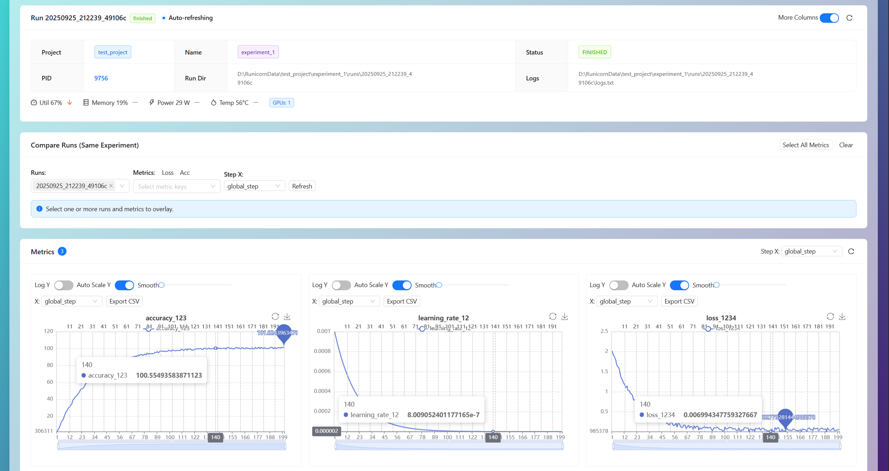

# Runicorn

**English** | [简体中文](README_zh.md)

[](https://pypi.org/project/runicorn/)
[](https://www.python.org/downloads/)
[](LICENSE)

<p align="center">
  
</p>

**Local, open-source ML experiment tracking.** 100% offline, zero telemetry. A modern self-hosted alternative to W&B.

---

## ✨ Highlights

| Feature | Description |
|---------|-------------|
| 🏠 **100% Local** | Your data never leaves your machine |
| 📊 **Real-time Visualization** | Live metrics, logs, and GPU monitoring |
| 📦 **Model Versioning** | Git-like Artifacts with deduplication |
| 🌐 **Remote Viewer** | Access remote GPU servers via SSH (like VSCode Remote) |
| 🖥️ **Desktop App** | Native Windows app with auto-backend |

<table>
  <tr>
    <td></td>
    <td></td>
  </tr>
</table>

---

## 🚀 Quick Start

```bash
pip install runicorn
runicorn viewer  # Open http://127.0.0.1:23300
```

```python
import runicorn as rn

run = rn.init(project="my_project", name="exp_1")

for epoch in range(100):
    loss = train_one_epoch()
    run.log({"loss": loss, "epoch": epoch})

run.finish()
```

---

## 📦 Model Versioning

```python
# Save
artifact = rn.Artifact("my-model", type="model")
artifact.add_file("model.pth")
run.log_artifact(artifact)  # → v1, v2, v3...

# Load
artifact = run.use_artifact("my-model:latest")
model_path = artifact.download()
```

---

## 🌐 Remote Viewer

Access remote GPU servers without file sync:

```bash
runicorn viewer  # → Click "Remote" → SSH credentials → Done!
```

| | Old Sync (v0.4) | Remote Viewer (v0.5+) |
|---|---|---|
| **Wait** | Minutes~Hours | Seconds |
| **Storage** | Required | Zero |
| **Real-time** | ❌ | ✅ |

---

## 📚 Documentation

| Resource | Link |
|----------|------|
| User Guide | [docs/user-guide/](docs/user-guide/) |
| API Reference | [docs/api/](docs/api/) |
| Changelog | [CHANGELOG.md](CHANGELOG.md) |

---

## 🆕 v0.5.3 (Latest)

- ⚡ **LTTB Downsampling** — 100k+ data points
- 💾 **Incremental Cache** — 300x faster parsing
- 🚀 **Lazy Loading** — Faster page load
- 🎯 **Unified Charts** — Single component for all scenarios

---

## License

MIT — see [LICENSE](LICENSE)

---

**Version**: v0.5.3 | **Last Updated**: 2025-11-28
