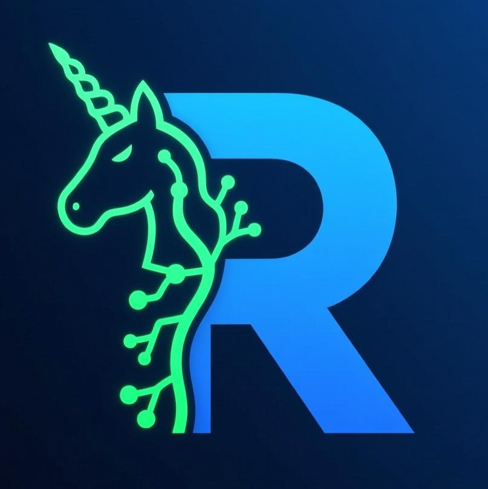

# Runicorn

[English](README.md) | **简体中文**

[](https://pypi.org/project/runicorn/)
[](https://www.python.org/downloads/)
[](LICENSE)

<p align="center">
  
</p>

**面向自有机器和 GPU 服务器的本地优先实验追踪工具。**

Runicorn 把 Python SDK、Web UI、Remote Viewer 和可选的 Windows 桌面端整合进同一套工作流。它适合那些不想把实验记录推到 SaaS 平台、不想先把远程 run 目录同步回本地、也不想为了接入实验追踪重写整套训练代码的人。

如果你的实验运行在远程 Linux 机器上，Runicorn 可以直接在远端启动一个轻量 Viewer，并通过 SSH 隧道映射到本地浏览器或桌面端，让你在数据实际所在的位置查看实验。

[文档站首页](https://skydoge-zjm.github.io/Runicorn/)

<p align="center">
  
</p>

---

## 为什么用 Runicorn

- **数据边界可控**：runs、logs、assets、settings 都保留在你自己控制的存储中
- **远程查看不依赖文件同步**：通过 SSH 直接查看远程 GPU 服务器上的实验，无需先复制 run 文件夹
- **迁移成本低**：从 `rn.init(...)` 和 `run.log(...)` 开始接入，同时兼容 `print()`、Python `logging`、torchvision `MetricLogger`、ImageNet meters、TensorBoard、tensorboardX
- **实验上下文完整**：除了标量指标，还能把配置、数据集、预训练来源、代码快照和输出归档统一关联到 run
- **本地 UI 足够完整**：路径树、对比模式、资产仓库、回收站、导入导出、GPU 遥测、远程会话管理都在同一套界面里

---

## 适合谁

**适合**

- 训练主要发生在本地或自有服务器，希望避免 SaaS 绑定
- 经常在本地工作站和远程 GPU 机器之间切换
- 希望把指标、日志、代码上下文、实验资产绑定到同一个 run
- 已经有现成训练代码，希望渐进式接入，而不是大规模重构

**不太适合**

- 你需要开箱即用的托管协作平台、云端仪表盘或团队权限系统
- 你只想要一个极简 CSV 记录器，不关心后续浏览和回看实验
- 你的工作流本来就依赖托管在线生态，而不是本地或自控基础设施

---

## 快速开始

安装：

```bash
pip install -U runicorn
```

记录第一个 run：

```python
import runicorn as rn

run = rn.init(
    path="cv/resnet50/baseline",
    alias="trial-01",
    capture_console=True,
)

for epoch in range(1, 11):
    train_loss = 1.0 / epoch
    val_acc = 0.70 + epoch * 0.02
    run.log({"train_loss": train_loss, "val_acc": val_acc})

run.summary({"notes": "first stable run"})
run.finish()
```

打开 Viewer：

```bash
runicorn viewer
```

然后访问 [http://127.0.0.1:23300](http://127.0.0.1:23300)。

---

## 它和常见工作流的区别

| 工作方式 | 常见问题 | Runicorn |
|---|---|---|
| 手工维护本地目录和脚本 | 指标、日志、配置、输出容易散开 | 把实验历史、summary、日志和资产绑定到同一个 run |
| SSH 登录远程机器 + tail 日志 + 临时画图 | 查看慢、对比难、上下文容易丢 | Remote Viewer 通过 SSH 提供结构化界面，不要求先同步 |
| 托管式实验追踪平台 | 依赖外网、服务方和外部存储 | 实验数据保留在本地和自有存储边界内 |

---

## Remote Viewer

如果训练主要运行在远程 GPU 服务器上，Runicorn 的价值会更明显。

你可以通过 SSH 连接远程机器、选择远程 Python 环境、启动远程 Viewer，并在本地浏览器或桌面端里直接查看远程实验。

不需要本地副本。  
不需要手工同步。  
不需要等待大体积 run 文件夹复制回本地。

```bash
runicorn viewer
# 打开 Remote 页面 -> 通过 SSH 连接 -> 选择环境 -> 启动会话
```

| | 传统同步式流程 | Remote Viewer |
|---|---|---|
| 等待时间 | 分钟到小时 | 秒级 |
| 本地存储拷贝 | 需要 | 不需要 |
| 实验查看方式 | 延迟查看 | 直接通过 SSH 查看 |

---

## 日志兼容性

Runicorn 的设计目标之一，是尽量贴近现有训练代码。

如果你的训练循环已经在用 torchvision 风格的 metric logging，很多时候只需要替换一个 import：

```python
from runicorn.log_compat.torchvision import MetricLogger as MetricLogger
```

另外也提供这些兼容层：

- `runicorn.log_compat.imagenet`
- `runicorn.log_compat.tensorboard`
- `runicorn.log_compat.tensorboardX`

Runicorn 也支持采集 `print()` 输出和 Python `logging` 日志，但更重要的价值在于：它能把现有训练过程中的指标信号纳入结构化实验曲线，而不强迫你重写整套 logging。

---

## 资产与实验上下文

Runicorn 不只记录标量指标。它也能把让实验“之后还能看懂”的上下文一起记下来：

- 配置元数据
- 数据集引用
- 预训练模型引用
- 代码快照
- 输出文件归档
- 跨 run 资产浏览与预览

你可以在 run 内直接用 `run.log_config(...)`、`run.log_dataset(...)`、`run.log_pretrained(...)` 把这些上下文关联到实验记录中。

---

## 文档

- [Quick Start](docs/user-guide/docs/getting-started/quickstart.md)
- [Remote Viewer Guide](docs/user-guide/docs/getting-started/remote-viewer.md)
- [Python SDK Overview](docs/user-guide/docs/sdk/overview.md)
- [Web UI Overview](docs/user-guide/docs/ui/overview.md)
- [CLI Overview](docs/user-guide/docs/cli/overview.md)
- [更新日志](CHANGELOG.md)

---

## 许可证

MIT。详见 [LICENSE](LICENSE)。
