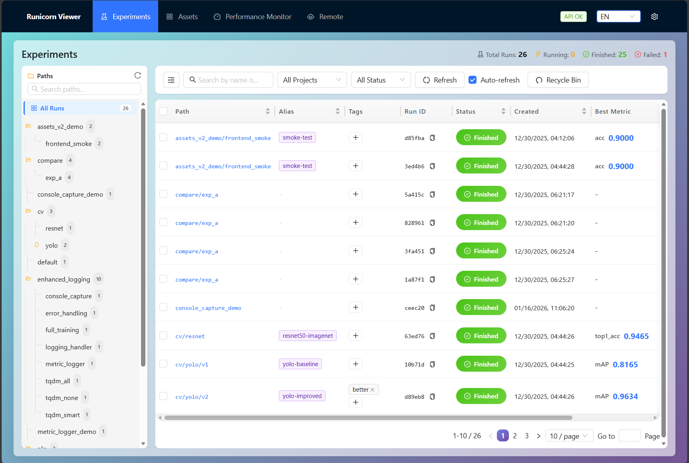
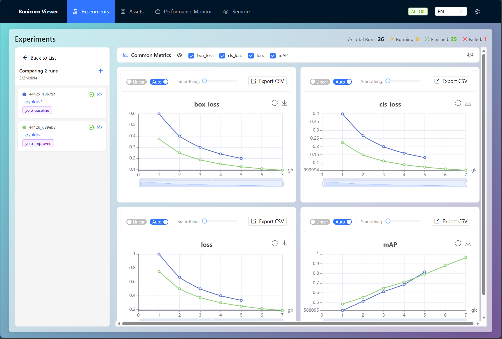

# Runicorn

[English](README.md) | **简体中文**

[](https://pypi.org/project/runicorn/)
[](https://www.python.org/downloads/)
[](LICENSE)

<p align="center">
  
</p>

**本地、开源的 ML 实验追踪工具。** 100% 离线，零遥测。现代化的 W&B 自托管替代方案。

---

## ✨ 核心特性

| 特性 | 描述 |
|------|------|
| 🏠 **100% 本地** | 数据永远不离开你的机器 |
| 📊 **实时可视化** | 实时指标、日志和 GPU 监控 |
| 📦 **资产与快照** | 工作区快照，以及数据集/配置/预训练模型引用 |
| 🌐 **Remote Viewer** | 通过 SSH 访问远程 GPU 服务器（类似 VSCode Remote） |
| 🖥️ **桌面应用** | Windows 原生应用，自动后端 |

<table>
  <tr>
    <td></td>
    <td></td>
  </tr>
</table>

---

## 🚀 快速开始

```bash
pip install runicorn
runicorn viewer  # 打开 http://127.0.0.1:23300
```

```python
import runicorn as rn

run = rn.init(path="my_project/exp_1", alias="baseline")

for epoch in range(100):
    loss = train_one_epoch()
    run.log({"loss": loss}, step=epoch + 1)

run.finish()
```

---

## 📦 资产与工作区快照

```python
from pathlib import Path

snapshot = rn.snapshot_workspace(Path.cwd(), Path("workspace_snapshot.zip"))

print(snapshot["archive_path"])
print(snapshot["file_count"])
```

在 run 内可以使用 `run.log_config(...)`、`run.log_dataset(...)` 和 `run.log_pretrained(...)` 记录可复用的训练上下文；旧的 `Artifact` API 已不再公开。

---

## 🌐 Remote Viewer

无需文件同步，直接访问远程 GPU 服务器：

```bash
runicorn viewer  # → 点击 "Remote" → 输入 SSH 信息 → 完成！
```

| | 旧版同步 (v0.4) | Remote Viewer (v0.5+) |
|---|---|---|
| **等待时间** | 分钟~小时 | 秒级 |
| **本地存储** | 需要 | 零占用 |
| **实时性** | ❌ | ✅ |

---

## 📚 文档

| 资源 | 链接 |
|------|------|
| 用户指南 | [docs/user-guide/](docs/user-guide/) |
| API 参考 | [docs/api/](docs/api/) |
| 更新日志 | [CHANGELOG.md](CHANGELOG.md) |

---

## 🆕 v0.7.0（最新）

- 🌐 **Remote Viewer 强化** — 保存连接、健康监控、重连状态与 OpenSSH 密码支持
- 🎨 **Web UI 产品化改进** — 更清晰的导航、更顺手的对比流程、ZIP 导入导出预览与统一回收站
- 📈 **日志与监控** — 虚拟滚动日志、更一致的暗色模式、后端采集的 GPU 遥测历史
- 🔌 **日志兼容增强** — 更好支持 ImageNet meters、TensorBoard 与 tensorboardX
- 🖥️ **桌面端改进** — 当前桌面工作流支持原生远程会话窗口

---

## 许可证

MIT — 详见 [LICENSE](LICENSE)

---

**版本**: v0.7.0 | **更新日期**: 2026-03-28
