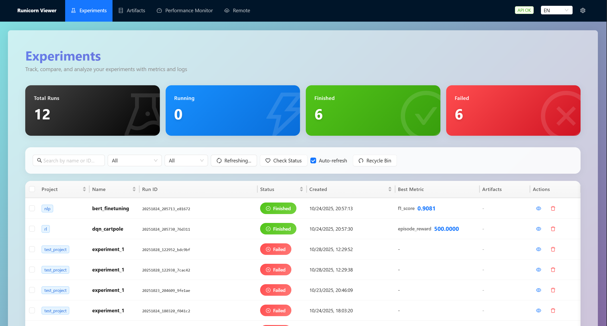

# Runicorn

[](https://pypi.org/project/runicorn/)
[](https://pypi.org/project/runicorn/)
[](LICENSE)

[English](README.md) | **简体中文**

<p align="center">
  
</p>

本地、开源的实验追踪与可视化工具，100% 离线。专业的机器学习实验管理平台，现代化的 W&B 自托管替代方案。

## ✨ 最新更新

### v0.5.0（最新）

**🚀 重大架构升级 - Remote Viewer**

Runicorn 0.5.0 引入了全新的 **Remote Viewer** 功能，采用类似 VSCode Remote Development 的架构，彻底改变了远程服务器访问方式。

**核心变化**：
- 🌐 **VSCode Remote 架构** - 在远程服务器直接运行 Viewer，通过 SSH 隧道在本地浏览器访问
- ⚡ **实时访问** - 无需同步，直接访问远程数据，延迟 < 100ms
- 💾 **零本地存储** - 不再需要镜像远程数据到本地，节省大量磁盘空间
- 🔧 **环境自动检测** - 智能检测远程 Conda/Virtualenv 环境，选择即用
- 🔒 **安全连接** - SSH 密钥/密码认证，自动端口转发，所有通信加密
- 📊 **完整功能支持** - 远程模式下所有功能与本地模式完全一致

**对比旧版远程同步 (0.4.x)**：

| 特性 | 0.4.x 文件同步 | 0.5.0 Remote Viewer |
|------|----------------|--------------------|
| 数据传输 | 需要同步 GB 级数据 | 无需同步，实时访问 |
| 初始等待 | 数小时（大数据集） | 数秒（连接启动） |
| 本地存储 | 需要（镜像副本） | 不需要（零占用） |
| 实时性 | 延迟 5-10 分钟 | 完全实时（< 100ms） |
| 使用场景 | 偶尔查看 | 日常开发 |

**快速体验**：
```bash
runicorn viewer  # 启动本地 Viewer
# 打开浏览器 → 点击 "Remote" → 输入服务器信息 → 连接即用！
```

**界面与质量改进**：
- 🎨 **现代化UI动画** - Framer Motion驱动的组件，配置化动画系统
- 🖼️ **品牌标识** - 独角兽图标favicon，提升品牌识别度
- 🌐 **本地化优化** - 精确中文翻译，术语更易理解
- 🐧 **WSL兼容性** - 增强WSL/WSL2环境下的CPU监控
- 📝 **持久化日志** - 滚动日志文件（~/.runicorn/logs/viewer.log）便于诊断

→ [Remote Viewer 完整指南](docs/guides/zh/REMOTE_VIEWER_GUIDE.md)

---

<details>
<summary><b>历史版本更新</b></summary>

### v0.4.1

- 🆕 **系统信息面板** - 在设置中查看版本、存储和缓存统计
- 🎨 **深色模式改进** - 所有页面文字可读性更好
- ⚡ **稳定性与性能** - 优化资源管理和问题修复

### v0.4.0

- 📦 **模型版本控制** - Artifacts 系统，完整的模型和数据集版本管理
- 🔗 **自动血缘追踪** - 追踪模型、数据集和实验的完整依赖关系
- 💾 **智能去重存储** - 基于哈希的内容去重，节省 50-90% 存储空间
- 🌳 **可视化血缘图** - ECharts 交互式依赖关系图
- 🏷️ **版本别名** - latest, production 等语义化版本管理
- 🔐 **安全增强** - 三层路径遍历防护，输入验证
- ⚡ **性能优化** - 指标缓存，进程检查优化，响应速度提升 10-20 倍
- 🎨 **UI 改进** - 统一设计系统，图表控件优化，骨架屏加载

</details>

## 核心功能

- **Python包**: `runicorn` - 通用SDK，支持任何ML框架
- **实验追踪**: 自动记录指标、日志、环境信息，智能状态检测
- **模型版本控制**: Artifacts系统 - 模型、数据集的Git-like管理
- **Web查看器**: 现代化界面，实时图表和实验对比
- **Remote Viewer** 🆕: VSCode Remote 风格架构，实时访问远程服务器
- **桌面应用**: Windows原生应用，自动后端启动
- **GPU监控**: 实时GPU遥测（需要`nvidia-smi`）

<table>
  <tr>
    <td width="50%"></td>
    <td width="50%"></td>
  </tr>
  <tr>
    <td width="50%"></td>
    <td width="50%"></td>
  </tr>
</table>

<p align="center">
  <span style="color:#888; font-size: 12px;">界面展示</span>
</p>


## 特性

### 🏠 **本地安全**
- 100% 本地，数据只存储在你的机器上
- 零遥测，完全隐私保护
- 安装后可完全离线使用

### 🎯 **智能实验追踪**
- **通用最佳指标** - 自定义主要指标，自动追踪最优值
- **智能状态检测** - 自动检测程序崩溃和中断状态
- **软删除和回收站** - 安全的实验管理，支持误删恢复
- **环境自动捕获** - 自动记录Git信息、依赖项、系统规格

### 📊 **高级可视化**
- **多运行对比** - 在单个图表上叠加多个实验
- **响应式图表** - 适配任何屏幕尺寸的自适应布局
- **实时更新** - 通过WebSocket实现实时日志和GPU监控
- **多种导出格式** - CSV、Excel、TensorBoard、Markdown报告

### 🎨 **现代界面**
- **分栏设置** - 全面自定义选项，实时预览
- **多语言支持** - 完整的中英文国际化
- **玻璃拟态界面** - 美观的现代设计，可定制主题
- **智能布局** - 自动响应式设计

### 🌐 **Remote Viewer** (🆕 v0.5.0 新功能)
- **VSCode Remote 架构** - 在远程服务器运行 Viewer 进程
- **零同步延迟** - 直接访问远程数据，无需等待同步
- **自动环境检测** - 智能识别 Conda、Virtualenv 环境
- **SSH 隧道** - 安全的端口转发，支持密钥和密码认证
- **完整功能支持** - 所有功能在远程模式下完全可用

## 安装

### 基本安装

**本地使用**：
```bash
pip install -U runicorn
```

**远程服务器**（如需使用 Remote Viewer）：
```bash
# 在远程 Linux 服务器上也安装 Runicorn
ssh user@remote-server
pip install -U runicorn
```

### 系统要求

- **Python**: 3.8+
- **操作系统**: Windows/Linux
- **桌面应用**: 仅 Windows（CLI/Viewer 跨平台）
- **Remote Viewer**: 远程服务器需 Linux（支持 WSL）

## 快速开始

### 开启查看器

```bash
runicorn viewer
# 或自定义参数
runicorn viewer --host 127.0.0.1 --port 8000
# 打开 http://127.0.0.1:8000
```
（推荐）如果安装了桌面应用 Runicorn Desktop，直接双击运行即可。

### 设置本地存储根目录
- “用户级根目录”可通过 UI 或 CLI 设置：

  - 桌面应用 UI：右上角齿轮 → 设置 → 数据目录 → 保存数据目录。

  - 通过 CLI：
  ```bash
  runicorn config --set-user-root "E:\\RunicornData"
  # 设置用户级根目录
  runicorn config --show
  # 查看当前配置
  ```
  - 该配置信息会写入到 `%APPDATA%\Runicorn\config.json`，也可以直接修改该文件。

### 实验追踪示例

```python
import runicorn as rn
import math, random

# 初始化实验，自动捕获环境信息
run = rn.init(project="test_project", name="experiment_1", capture_env=True)
print(f"Created run: id={run.id} dir={run.run_dir}")

# 使用 rn.log_text 记录文本信息
rn.log_text(f"[info] Starting dummy run '{run.name}' (project={run.project})")

# 设置主要指标，系统自动追踪最优值
rn.set_primary_metric("accuracy", mode="max")  # 或 mode="min" 用于loss

stages = ["warmup", "train", "eval"]
for i in range(1, 101):
    stage = stages[min((i - 1) // 33, len(stages) - 1)]
    
    # 模拟训练指标
    loss = max(0.02, 2.0 * math.exp(-0.02 * i) + random.uniform(-0.02, 0.02))
    accuracy = min(95.0, 60 + i * 0.3 + random.uniform(-2, 2))
    
    # 记录指标 - 最佳准确率将被自动追踪
    rn.log({
        "loss": round(loss, 4),
        "accuracy": round(accuracy, 2),
        "learning_rate": 0.001 * (0.95 ** i)
    }, stage=stage)

# 摘要指标
rn.summary({
    "final_accuracy": 92.1,
    "total_epochs": 100,
    "notes": "改进架构的基线模型"
})

rn.finish()  # 最佳指标自动保存
```

### 模型版本控制示例（v0.4.0 新功能）

```python
import runicorn as rn

# 训练模型
run = rn.init(project="image_classification", name="resnet_training")

# ... 训练代码 ...
# torch.save(model.state_dict(), "model.pth")

# 保存模型为 Artifact（自动版本控制）
model = rn.Artifact("resnet50-model", type="model")
model.add_file("model.pth")
model.add_metadata({
    "architecture": "ResNet50",
    "val_accuracy": 0.95,
    "epochs": 100
})

version = run.log_artifact(model)  # → v1, v2, v3...
print(f"已保存: resnet50-model:v{version}")

rn.finish()

# 使用保存的模型
run2 = rn.init(project="inference")

model = run2.use_artifact("resnet50-model:latest")  # 或 "resnet50-model:v3"
model_path = model.download()

# 加载模型...
rn.finish()
```

### 高级功能
#### 数据导出（可选）
```python
if hasattr(rn, 'MetricsExporter'):
    exporter = rn.MetricsExporter(run.run_dir)
    exporter.to_excel("results.xlsx", include_charts=True)
    exporter.generate_report("report.md", format="markdown")
```

#### 显式覆盖存储根目录（可选） 
```python
run = rn.init(project="demo", name="exp1", storage="E:\\RunicornData")
```
存储根目录的优先级（从高到低）：
  1. `runicorn.init(storage=...)`
  2. 环境变量 `RUNICORN_DIR`
  3. 全局配置 `user_root_dir`（通过 `runicorn config` 或Web界面设置）


## 🌐 Remote Viewer 使用指南

### 什么是 Remote Viewer？

Remote Viewer 采用**类似 VSCode Remote Development 的架构**，让你可以：
- 在**远程服务器上运行 Viewer 进程**
- 通过 **SSH 隧道**在本地浏览器访问
- **实时查看**远程实验数据，无需同步

### 5 分钟快速开始

#### 步骤 1：确保远程服务器已安装 Runicorn

```bash
# SSH 登录到远程服务器
ssh user@gpu-server.com

# 安装 Runicorn
pip install runicorn
# 或在 conda 环境中
conda activate your-env
pip install runicorn
```

#### 步骤 2：启动本地 Viewer

```bash
# 在本地机器上
runicorn viewer
# 浏览器自动打开 http://localhost:23300
```

#### 步骤 3：连接远程服务器

1. 点击顶部菜单栏的 **"Remote"** 按钮
2. 填写 SSH 连接信息：
   - **主机**: `gpu-server.com`
   - **端口**: `22`
   - **用户名**: `your-username`
   - **认证方式**：SS
H 密钥或密码
3. 点击 **"连接到服务器"**

#### 步骤 4：选择 Python 环境

系统会自动检测远程服务器上的 Python 环境，显示列表：

| 环境名称 | Python 版本 | Runicorn 版本 | 存储根目录 |
|---------|------------|--------------|----------|
| base | Python 3.10.8 | 0.5.0 | /home/user/RunicornData |
| pytorch-env | Python 3.9.15 | 0.5.0 | /data/experiments |

选择你想使用的环境，点击 **"使用此环境"**

#### 步骤 5：启动 Remote Viewer

查看配置摘要，点击 **"启动 Remote Viewer"**

```
远程服务器: gpu-server.com
Python 环境: pytorch-env
Runicorn 版本: 0.5.0
存储根目录: /data/experiments
```

#### 步骤 6：访问远程数据

自动打开新浏览器标签页，地址类似：`http://localhost:8081`

像使用本地 Viewer 一样浏览远程实验数据！

### 常见问题

**Q: 支持 Windows 远程服务器吗？**  
A: 目前仅支持 Linux 远程服务器（包括 WSL）。

**Q: 可以同时连接多台服务器吗？**  
A: 可以，每个连接使用不同的本地端口。

**Q: 断开连接后数据会丢失吗？**  
A: 不会，数据仍在远程服务器上。重新连接即可继续访问。

→ **完整指南**: [Remote Viewer 用户指南](docs/guides/zh/REMOTE_VIEWER_GUIDE.md)

---

<details>
<summary><b>⚠️  旧版远程同步（已弃用）</b></summary>

> **已弃用 (Deprecated in v0.5.0)**  
> 
> 0.4.x 的文件同步功能已被 Remote Viewer 取代。  
> 请使用上面的新功能，体验更好、更快、更简单！
> 
> **迁移指南**: [0.4.x → 0.5.0 迁移指南](docs/guides/zh/MIGRATION_GUIDE_v0.4_to_v0.5.md)

旧版本的文件同步方式仍可使用，但不再推荐：

- 打开 UI 顶部导航中的「远程」页面
- 操作步骤：
  1) 连接：输入 `主机`、`端口`、`用户名`、`密码/私钥`
  2) 浏览远程目录并选择正确的层级
  3) 点击「同步此目录」

</details>

## 桌面应用（Windows）

- 推荐普通用户通过 GitHub Releases 安装，或在本地自行构建安装包。
- 构建前置依赖：Node.js 18+；Rust & Cargo（稳定版）；Python 3.8+；NSIS（用于打包安装器）
- 本地构建（生成 NSIS 安装器）：

  ```powershell
  # 在仓库根目录执行
  powershell -ExecutionPolicy Bypass -File .\desktop\tauri\build_release.ps1 -Bundles nsis
  # 安装包输出路径：
  # desktop/tauri/src-tauri/target/release/bundle/nsis/Runicorn Desktop_<version>_x64-setup.exe
  ```

- 安装后启动「Runicorn Desktop」。
  - 首次运行：右上角齿轮 → 设置 → 数据目录，选择一个可写路径（如 `D:\RunicornData`），点击保存。
  - 桌面应用会自动启动本地后端并打开 UI。

## 隐私与离线

- 无遥测收集；Viewer 仅读取本地 JSON/JSONL/媒体文件
- UI 打包进 wheel，运行时不依赖 Node.js

## 存储结构

```
user_root_dir/
  <project>/
    <name>/
      runs/
        <run_id>/
          meta.json
          status.json
          summary.json
          events.jsonl
          logs.txt
          media/
```

## API 文档

- **REST API 参考**: 查看 [docs/api/](docs/api/) 获取完整API文档
- **交互式文档**: 启动 viewer 后访问 `http://127.0.0.1:23300/docs` (FastAPI自动生成)
- **快速参考**: [docs/api/QUICK_REFERENCE.md](docs/api/QUICK_REFERENCE.md) - 常用操作速查表

## 社区

- 开发规范与提交流程：`CONTRIBUTING.md`
- 安全披露：`SECURITY.md`
- 版本历史：`CHANGELOG.md`


## 贡献

欢迎贡献！请查阅 [CONTRIBUTING.md](CONTRIBUTING.md) 了解详情。

## 许可证

MIT License - 详见 [LICENSE](LICENSE) 文件。

AI 
-------
该项目主要借助 Claude 模型进行开发。

---

**作者**: Runicorn Development Team  
**版本**: v0.5.0  
**最后更新**: 2025-10-28
