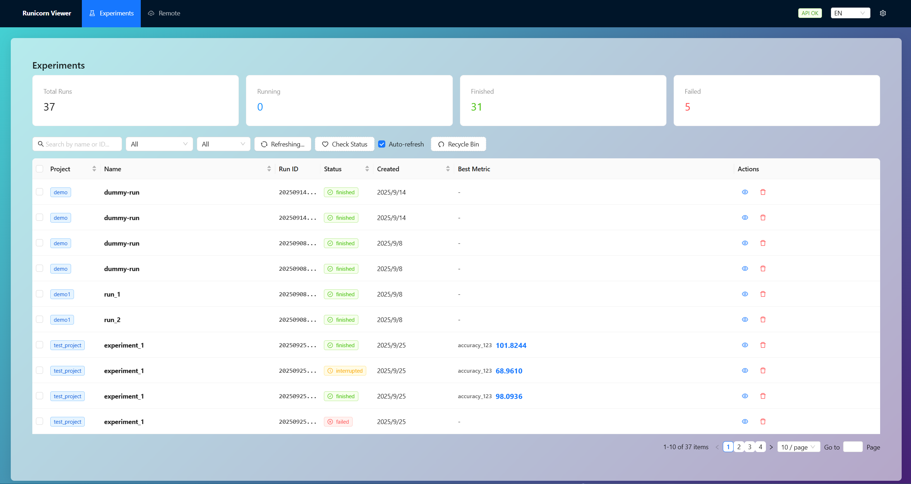

# Runicorn

[](https://pypi.org/project/runicorn/)
[](https://pypi.org/project/runicorn/)
[](LICENSE)

[English](README.md) | **简体中文**

<p align="center">
  
</p>

本地、开源的实验追踪与可视化工具，100% 离线。专业的机器学习实验管理平台，现代化的 W&B 自托管替代方案。

## ✨ v0.4.0 新特性

- 📦 **模型版本控制** - Artifacts 系统，完整的模型和数据集版本管理
- 🔗 **自动血缘追踪** - 追踪模型、数据集和实验的完整依赖关系
- 💾 **智能去重存储** - 基于哈希的内容去重，节省 50-90% 存储空间
- 🌳 **可视化血缘图** - ECharts 交互式依赖关系图
- 🏷️ **版本别名** - latest, production 等语义化版本管理
- 🔐 **安全增强** - 三层路径遍历防护，输入验证
- ⚡ **性能优化** - 指标缓存，进程检查优化，响应速度提升 10-20 倍
- 🎨 **UI 改进** - 统一设计系统，图表控件优化，骨架屏加载

## 核心功能

- **Python包**: `runicorn` - 通用SDK，支持任何ML框架
- **模型版本控制**: Artifacts系统 - 模型、数据集的Git-like管理
- **Web查看器**: 实时图表界面和实验对比功能
- **远程同步**: Linux服务器实时SSH镜像
- **桌面应用**: Windows原生应用，自动后端启动
- **GPU监控**: 实时GPU遥测（需要`nvidia-smi`）

<p align="center">
  
  <br/>
  
  <br/>
  
  <br/>
  <span style="color:#888; font-size: 12px;">界面</span>
</p>


## 特性

### 🏠 **本地安全**
- 100% 本地，数据只存储在你的机器上
- 零遥测，完全隐私保护
- 安装后可完全离线使用

### 🎯 **智能实验追踪**
- **通用最佳指标** - 自定义主要指标，自动追踪最优值
- **智能状态检测** - 自动检测程序崩溃和中断状态
- **软删除和回收站** - 安全的实验管理，支持误删恢复
- **环境自动捕获** - 自动记录Git信息、依赖项、系统规格

### 📊 **高级可视化**
- **多运行对比** - 在单个图表上叠加多个实验
- **响应式图表** - 适配任何屏幕尺寸的自适应布局
- **实时更新** - 通过WebSocket实现实时日志和GPU监控
- **多种导出格式** - CSV、Excel、TensorBoard、Markdown报告

### 🎨 **现代界面**
- **分栏设置** - 全面自定义选项，实时预览
- **多语言支持** - 完整的中英文国际化
- **玻璃拟态界面** - 美观的现代设计，可定制主题
- **智能布局** - 自动响应式设计

## 安装

需要 Python 3.8+（Windows/Linux）。桌面应用目前仅 Windows 可用；CLI/Viewer 在 Windows 与 Linux 均可运行。

```bash
pip install -U runicorn
```

## 快速开始

### 开启查看器

```bash
runicorn viewer
# 或自定义参数
runicorn viewer --host 127.0.0.1 --port 8000
# 打开 http://127.0.0.1:8000
```
（推荐）如果安装了桌面应用 Runicorn Desktop，直接双击运行即可。

### 设置本地存储根目录
- “用户级根目录”可通过 UI 或 CLI 设置：

  - 桌面应用 UI：右上角齿轮 → 设置 → 数据目录 → 保存数据目录。

  - 通过 CLI：
  ```bash
  runicorn config --set-user-root "E:\\RunicornData"
  # 设置用户级根目录
  runicorn config --show
  # 查看当前配置
  ```
  - 该配置信息会写入到 `%APPDATA%\Runicorn\config.json`，也可以直接修改该文件。

### 实验追踪示例

```python
import runicorn as rn
import math, random

# 初始化实验，自动捕获环境信息
run = rn.init(project="test_project", name="experiment_1", capture_env=True)
print(f"Created run: id={run.id} dir={run.run_dir}")

# 使用 rn.log_text 记录文本信息
rn.log_text(f"[info] Starting dummy run '{run.name}' (project={run.project})")

# 设置主要指标，系统自动追踪最优值
rn.set_primary_metric("accuracy", mode="max")  # 或 mode="min" 用于loss

stages = ["warmup", "train", "eval"]
for i in range(1, 101):
    stage = stages[min((i - 1) // 33, len(stages) - 1)]
    
    # 模拟训练指标
    loss = max(0.02, 2.0 * math.exp(-0.02 * i) + random.uniform(-0.02, 0.02))
    accuracy = min(95.0, 60 + i * 0.3 + random.uniform(-2, 2))
    
    # 记录指标 - 最佳准确率将被自动追踪
    rn.log({
        "loss": round(loss, 4),
        "accuracy": round(accuracy, 2),
        "learning_rate": 0.001 * (0.95 ** i)
    }, stage=stage)

# 摘要指标
rn.summary({
    "final_accuracy": 92.1,
    "total_epochs": 100,
    "notes": "改进架构的基线模型"
})

rn.finish()  # 最佳指标自动保存
```

### 模型版本控制示例（v0.4.0 新功能）

```python
import runicorn as rn

# 训练模型
run = rn.init(project="image_classification", name="resnet_training")

# ... 训练代码 ...
# torch.save(model.state_dict(), "model.pth")

# 保存模型为 Artifact（自动版本控制）
model = rn.Artifact("resnet50-model", type="model")
model.add_file("model.pth")
model.add_metadata({
    "architecture": "ResNet50",
    "val_accuracy": 0.95,
    "epochs": 100
})

version = run.log_artifact(model)  # → v1, v2, v3...
print(f"已保存: resnet50-model:v{version}")

rn.finish()

# 使用保存的模型
run2 = rn.init(project="inference")

model = run2.use_artifact("resnet50-model:latest")  # 或 "resnet50-model:v3"
model_path = model.download()

# 加载模型...
rn.finish()
```

### 高级功能
#### 数据导出（可选）
```python
if hasattr(rn, 'MetricsExporter'):
    exporter = rn.MetricsExporter(run.run_dir)
    exporter.to_excel("results.xlsx", include_charts=True)
    exporter.generate_report("report.md", format="markdown")
```

#### 显式覆盖存储根目录（可选） 
```python
run = rn.init(project="demo", name="exp1", storage="E:\\RunicornData")
```
存储根目录的优先级（从高到低）：
  1. `runicorn.init(storage=...)`
  2. 环境变量 `RUNICORN_DIR`
  3. 全局配置 `user_root_dir`（通过 `runicorn config` 或Web界面设置）


## 远程同步

将远程 Linux 服务器上的记录通过 SSH 实时镜像到本机 storage。

- 打开 UI 顶部导航中的「远程」页面
- 操作步骤：
  1) 连接：输入 `主机`、`端口`（默认 22）、`用户名`；可选输入 `密码` 或 `私钥内容/路径`
  2) 浏览远程目录并选择正确的层级：
     - 0.2.0 及以上版本：建议选择到用户根目录
  3) 点击「同步此目录」。下方会出现「同步任务」，「Runs」页面会立即刷新

小贴士与排查
- 看不到运行时，请确认：
  - 同步任务是否存在：GET `/api/ssh/mirror/list` 应显示 `alive: true`，统计项递增
  - 本地存储根是否正确：GET `/api/config` 查看 `storage` 路径；检查是否按预期层级生成
  - 凭据仅用于本次会话，不会持久化；SSH 由 Paramiko 负责

## 桌面应用（Windows）

- 推荐普通用户通过 GitHub Releases 安装，或在本地自行构建安装包。
- 构建前置依赖：Node.js 18+；Rust & Cargo（稳定版）；Python 3.8+；NSIS（用于打包安装器）
- 本地构建（生成 NSIS 安装器）：

  ```powershell
  # 在仓库根目录执行
  powershell -ExecutionPolicy Bypass -File .\desktop\tauri\build_release.ps1 -Bundles nsis
  # 安装包输出路径：
  # desktop/tauri/src-tauri/target/release/bundle/nsis/Runicorn Desktop_<version>_x64-setup.exe
  ```

- 安装后启动「Runicorn Desktop」。
  - 首次运行：右上角齿轮 → 设置 → 数据目录，选择一个可写路径（如 `D:\RunicornData`），点击保存。
  - 桌面应用会自动启动本地后端并打开 UI。

## 隐私与离线

- 无遥测收集；Viewer 仅读取本地 JSON/JSONL/媒体文件
- UI 打包进 wheel，运行时不依赖 Node.js

## 存储结构

```
user_root_dir/
  <project>/
    <name>/
      runs/
        <run_id>/
          meta.json
          status.json
          summary.json
          events.jsonl
          logs.txt
          media/
```

## API 文档

- **REST API 参考**: 查看 [docs/api/](docs/api/) 获取完整API文档
- **交互式文档**: 启动 viewer 后访问 `http://127.0.0.1:23300/docs` (FastAPI自动生成)
- **快速参考**: [docs/api/QUICK_REFERENCE.md](docs/api/QUICK_REFERENCE.md) - 常用操作速查表

## 社区

- 开发规范与提交流程：`CONTRIBUTING.md`
- 安全披露：`SECURITY.md`
- 版本历史：`CHANGELOG.md`


AI
--
本项目主要由 OpenAI 的 GPT-5 开发。
