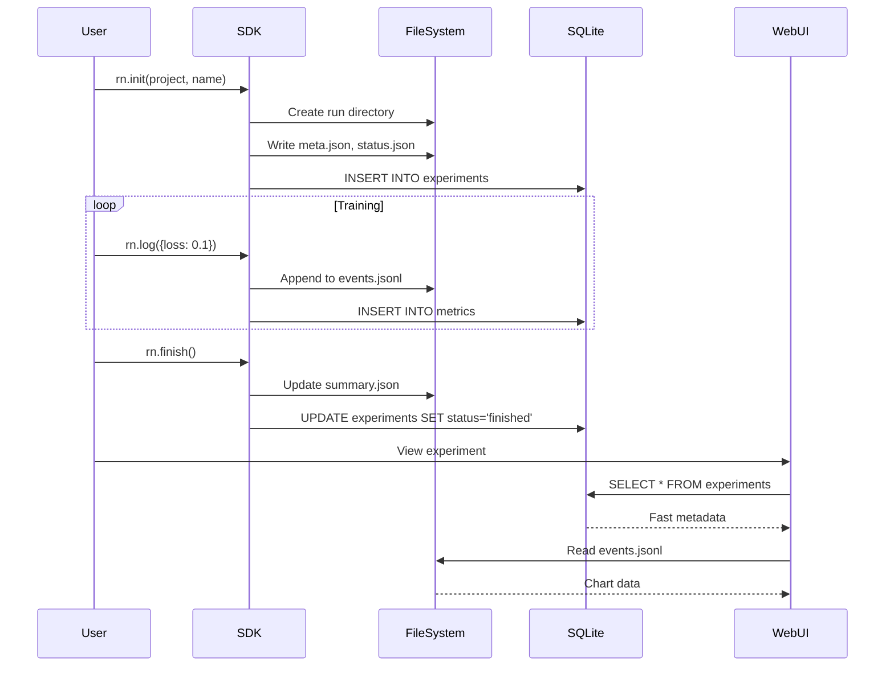

[English](DATA_FLOW.md) | [简体中文](../zh/DATA_FLOW.md)

---

# Data Flow Architecture

**Document Type**: Architecture  
**Purpose**: Document how data flows through the Runicorn system

---

## Experiment Lifecycle Flow



---

## Metrics Logging Pipeline

### Step-by-Step Flow

**1. User logs metrics**:
```python
rn.log({"loss": 0.5, "accuracy": 0.9}, step=100)
```

**2. SDK processes**:
```python
# Add metadata
payload = {
    "loss": 0.5,
    "accuracy": 0.9,
    "global_step": 100,
    "time": current_timestamp
}

# Write to file (V1 compatibility)
events_file.append(json.dumps(payload))

# Write to SQLite (V2 performance)
for metric_name, value in payload.items():
    metrics_table.insert(exp_id, metric_name, value, step)
```

**3. Web UI retrieves**:
```python
# V1: Parse JSONL file
metrics = parse_jsonl(events_file)

# V2: Query SQLite (100x faster)
metrics = SELECT * FROM metrics WHERE experiment_id = ? ORDER BY step
```

---

## Artifact Creation Flow

### Sequence

```
1. User creates artifact
   ↓
2. SDK stages files
   ↓
3. run.log_artifact() called
   ↓
4. For each file:
   - Compute SHA256 hash
   - Check dedup pool
   - Hard link or copy
   ↓
5. Create manifest.json
   ↓
6. Create metadata.json
   ↓
7. Update versions.json
   ↓
8. Write artifacts_created.json in run dir
   ↓
9. Return version number
```

### Deduplication Decision Tree

```
File to save
    ↓
Compute SHA256 hash
    ↓
Check: {hash} in dedup pool?
    ├─ Yes → Create hard link to existing file
    │         (Space saved!)
    └─ No  → Copy to dedup pool
              ↓
              Create hard link from destination
              ↓
              (New unique file)
```

---

## Remote Synchronization Flow

### Smart Mode (Metadata Only)

```
┌─────────────┐         SSH/SFTP        ┌──────────────┐
│ Local       │ ◄──────────────────────►│ Remote       │
│ Machine     │                          │ Server       │
└─────────────┘                          └──────────────┘

Step 1: Connect via SSH
Local ──[SSH Auth]──► Remote
      ◄──[Connected]──

Step 2: List remote structure
Local ──[SFTP ls]──────► Remote
      ◄──[Dir listing]──

Step 3: Sync metadata (JSON files only)
Local ──[SFTP get *.json]──► Remote
      ◄──[200MB metadata]───

Step 4: Cache locally
Local: Save to ~/.runicorn_remote_cache/
       ├── metadata/
       └── index.db

Step 5: User queries (from cache, instant)
User → WebUI → Cache → Display (no network)

Step 6: Download files on-demand
User clicks "Download"
   ↓
Local ──[SFTP get model.pth]──► Remote
      ◄──[8GB file transfer]───
   ↓
Saved to cache/downloads/
```

---

## WebSocket Log Streaming

### Real-time Flow

```
Training Process          Backend              Frontend
      │                      │                     │
      │ Write to logs.txt    │                     │
      ├──────────────────────►                     │
      │                      │                     │
      │                      │ tail -f logs.txt    │
      │                      ├─────────────────────► WebSocket
      │                      │                     │ connection
      │                      │ New line event      │
      │                      ├─────────────────────►
      │                      │                     │ Display
      │                      │                     │ in UI
```

### Implementation

**Backend** (FastAPI WebSocket):
```python
@app.websocket("/runs/{run_id}/logs/ws")
async def logs_websocket(websocket, run_id):
    await websocket.accept()
    
    log_file = get_log_path(run_id)
    
    with open(log_file) as f:
        # Send existing logs
        for line in f:
            await websocket.send_text(line)
        
        # Tail new lines
        while True:
            line = f.readline()
            if line:
                await websocket.send_text(line)
            else:
                await asyncio.sleep(0.1)
```

**Frontend** (React):
```javascript
const ws = new WebSocket('ws://localhost:23300/api/runs/{id}/logs/ws')

ws.onmessage = (event) => {
    setLogs(prev => [...prev, event.data])
}
```

---

## Artifact Usage Flow

### Loading and Using

```
1. User calls use_artifact()
   ↓
2. SDK parses "name:version"
   ↓
3. Load metadata.json
   ↓
4. Load manifest.json
   ↓
5. Create Artifact object
   ↓
6. Write to artifacts_used.json
   ↓
7. User calls download()
   ↓
8. Copy files to temp directory
   ↓
9. Return path
   ↓
10. User loads model from path
```

### Lineage Tracking (Automatic)

```
Artifact Created:
run.log_artifact(artifact)
    ↓
Write to: runs/{run_id}/artifacts_created.json
{
  "artifacts": [
    {"name": "my-model", "version": 3, "created_at": ...}
  ]
}

Artifact Used:
run.use_artifact("my-model:v3")
    ↓
Write to: runs/{run_id}/artifacts_used.json
{
  "artifacts": [
    {"name": "my-model", "version": 3, "used_at": ...}
  ]
}

Lineage Graph:
Traverse these JSON files to build dependency graph
```

---

## Query Optimization Flow

### V1 API (File Scanning)

```
GET /api/runs
    ↓
Scan directories
    ├─ project1/
    │  └─ name1/runs/* (100 runs)
    ├─ project2/
    │  └─ name2/runs/* (500 runs)
    ↓
Read JSON files (3-4 per run)
    ↓
Parse and aggregate
    ↓
Return after 5-10 seconds
```

### V2 API (SQLite Query)

```
GET /api/v2/experiments?project=X&status=finished
    ↓
Build SQL query
    ↓
SELECT * FROM experiments
WHERE project = 'X' AND status = 'finished'
ORDER BY created_at DESC
LIMIT 50
    ↓
Execute (uses indexes)
    ↓
Return in 50-100ms (100x faster!)
```

---

## Caching Strategy

### Metrics Caching

```
First Request:
User → API → Parse events.jsonl → Cache result → Return
                      (300ms)

Subsequent Requests (within 60s):
User → API → Check cache → Return cached
                  (5ms, 60x faster)

Cache Invalidation:
- TTL: 60 seconds
- Or: When new metrics logged
```

### Connection Pooling

```
Request 1 → Get connection from pool → Execute → Return to pool
Request 2 → Reuse connection → Execute → Return to pool
...
Request 10 → All reuse 10 pooled connections

Benefits:
- No connection setup overhead
- Thread-safe access
- Automatic cleanup
```

---

## Error Propagation

### From Storage to User

```
Storage Layer Error
    ↓
Business Logic catches
    ↓
Maps to HTTP status
    ↓
API returns JSON error
    ↓
Frontend displays user-friendly message
```

**Example**:
```python
# Storage
raise FileNotFoundError("Run directory not found")

# Business Logic
except FileNotFoundError:
    raise HTTPException(404, "Run not found")

# API Response
{"detail": "Run not found"}

# Frontend
message.error("实验未找到")
```

---

## Remote Viewer Data Flow (v0.5.0)

### Connection Establishment Flow

```
User (Browser)
    ↓
Click "Connect to Remote Server"
    ↓
Local Viewer API
    ↓
Connection Manager: Establish SSH connection
    ├─ Password / SSH key authentication
    ├─ Keep-alive setup
    └─ Add to connection pool
    ↓
Environment Detector: Scan remote environments
    ├─ Execute: conda env list
    ├─ Execute: which python
    ├─ For each env: import runicorn
    └─ Return compatible environment list
    ↓
Return connection status and environment list to frontend
```

### Remote Viewer Startup Flow

```
User selects environment
    ↓
POST /api/remote/viewer/start
    ↓
Viewer Launcher: Build startup command
    ↓
Execute via SSH:
    source /path/to/env/bin/activate && \
    runicorn viewer --host 127.0.0.1 --port 23300 --no-open-browser &
    ↓
Get process PID
    ↓
Tunnel Manager: Create SSH tunnel
    ├─ Remote: 127.0.0.1:23300
    └─ Local: 127.0.0.1:8081
    ↓
Health Checker: Verify Viewer startup
    ├─ Test connection: socket.connect(('127.0.0.1', 8081))
    └─ HTTP check: GET http://localhost:8081/api/health
    ↓
Return Viewer URL: http://localhost:8081
    ↓
Frontend auto-opens new tab
```

### Data Access Flow

```
Browser request
    ↓
http://localhost:8081/api/runs
    ↓
Local SSH tunnel
    ↓
Forward to remote: 127.0.0.1:23300
    ↓
Remote Viewer instance (FastAPI)
    ↓
Read remote data storage
    ├─ runicorn.db (SQLite)
    └─ ~/RunicornData/project/name/runs/
    ↓
Return JSON response
    ↓
Return through SSH tunnel
    ↓
Browser receives and renders
```

### Real-time Log Streaming (Remote)

```
Browser establishes WebSocket
    ↓
ws://localhost:8081/api/runs/{id}/logs/ws
    ↓
Local SSH tunnel (WebSocket upgrade)
    ↓
Forward to remote Viewer
    ↓
Remote Viewer reads log file
    ├─ tail -f /path/to/logs.txt
    └─ Continuous streaming
    ↓
Stream back through SSH tunnel
    ↓
Browser displays logs in real-time
```

### Health Check Flow

```
Timer (every 30 seconds)
    ↓
Health Checker performs checks
    ├─ 1. Connection check
    │   └─ SSH: echo "ping"
    ├─ 2. Viewer check
    │   └─ HTTP: GET http://localhost:8081/api/health
    └─ 3. Tunnel check
        └─ socket.connect(('127.0.0.1', 8081))
    ↓
If any check fails:
    ├─ Attempt auto-recovery
    │   ├─ SSH disconnected: Reconnect (max 3 attempts)
    │   ├─ Viewer crashed: Notify user
    │   └─ Tunnel broken: Rebuild tunnel
    └─ Update health status
    ↓
Frontend displays connection status indicator
```

### Disconnect Cleanup Flow

```
User clicks disconnect / closes tab
    ↓
DELETE /api/remote/connections/{id}?cleanup_viewer=true
    ↓
Cleanup steps:
    ├─ 1. Tunnel Manager: Close SSH tunnel
    │   └─ Stop forwarding thread
    ├─ 2. Viewer Launcher: Stop remote Viewer
    │   ├─ Via SSH: kill {pid}
    │   └─ Delete log file
    └─ 3. Connection Manager: Close SSH connection
        └─ Remove from connection pool
    ↓
Return cleanup status
    ↓
Frontend updates UI, removes connection
```

---

**Related**: [COMPONENT_ARCHITECTURE.md](COMPONENT_ARCHITECTURE.md) | [STORAGE_DESIGN.md](STORAGE_DESIGN.md) | [REMOTE_VIEWER_ARCHITECTURE.md](REMOTE_VIEWER_ARCHITECTURE.md)

**Back to**: [Architecture Index](README.md)

