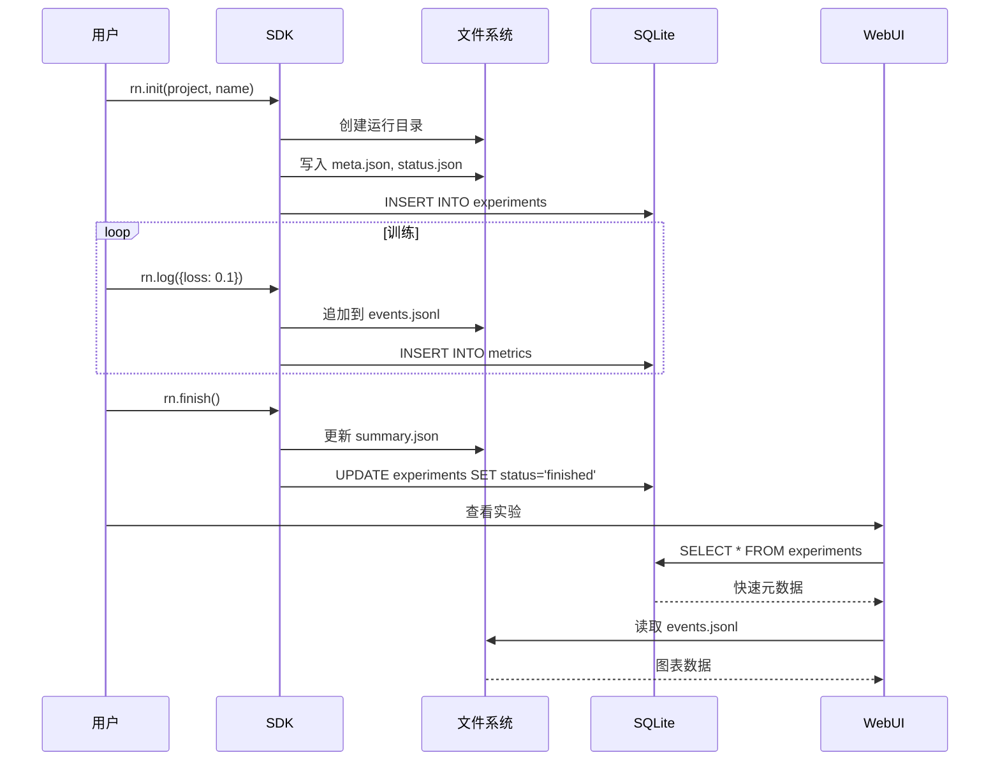

[English](../en/DATA_FLOW.md) | [简体中文](DATA_FLOW.md)

---

# 数据流架构

**文档类型**: 架构  
**目的**: 记录数据如何流经 Runicorn 系统

---

## 实验生命周期流程



---

## 指标记录管道

### 逐步流程

**1. 用户记录指标**:
```python
rn.log({"loss": 0.5, "accuracy": 0.9}, step=100)
```

**2. SDK 处理**:
```python
# 添加元数据
payload = {
    "loss": 0.5,
    "accuracy": 0.9,
    "global_step": 100,
    "time": current_timestamp
}

# 写入文件（V1 兼容）
events_file.append(json.dumps(payload))

# 写入 SQLite（V2 性能）
for metric_name, value in payload.items():
    metrics_table.insert(exp_id, metric_name, value, step)
```

**3. Web UI 检索**:
```python
# V1: 解析 JSONL 文件
metrics = parse_jsonl(events_file)

# V2: 查询 SQLite（快 100 倍）
metrics = SELECT * FROM metrics WHERE experiment_id = ? ORDER BY step
```

---

## Artifact 创建流程

### 序列

```
1. 用户创建 artifact
   ↓
2. SDK 暂存文件
   ↓
3. 调用 run.log_artifact()
   ↓
4. 对于每个文件:
   - 计算 SHA256 哈希
   - 检查去重池
   - 硬链接或复制
   ↓
5. 创建 manifest.json
   ↓
6. 创建 metadata.json
   ↓
7. 更新 versions.json
   ↓
8. 在运行目录写入 artifacts_created.json
   ↓
9. 返回版本号
```

### 去重决策树

```
要保存的文件
    ↓
计算 SHA256 哈希
    ↓
检查: {hash} 在去重池中？
    ├─ 是 → 创建硬链接到现有文件
    │         (节省空间！)
    └─ 否 → 复制到去重池
              ↓
              从目标创建硬链接
              ↓
              (新的唯一文件)
```

---

## 远程同步流程

### 智能模式（仅元数据）

```
┌─────────────┐         SSH/SFTP        ┌──────────────┐
│ 本地        │ ◄──────────────────────►│ 远程         │
│ 机器        │                          │ 服务器       │
└─────────────┘                          └──────────────┘

步骤 1: 通过 SSH 连接
本地 ──[SSH 认证]──► 远程
      ◄──[已连接]──

步骤 2: 列出远程结构
本地 ──[SFTP ls]──────► 远程
      ◄──[目录列表]──

步骤 3: 同步元数据（仅 JSON 文件）
本地 ──[SFTP get *.json]──► 远程
      ◄──[200MB 元数据]───

步骤 4: 本地缓存
本地: 保存到 ~/.runicorn_remote_cache/
       ├── metadata/
       └── index.db

步骤 5: 用户查询（从缓存，即时）
用户 → WebUI → 缓存 → 显示（无网络）

步骤 6: 按需下载文件
用户点击"下载"
   ↓
本地 ──[SFTP get model.pth]──► 远程
      ◄──[8GB 文件传输]───
   ↓
保存到 cache/downloads/
```

---

## WebSocket 日志流

### 实时流程

```
训练进程             后端              前端
      │                      │                     │
      │ 写入 logs.txt        │                     │
      ├──────────────────────►                     │
      │                      │                     │
      │                      │ tail -f logs.txt    │
      │                      ├─────────────────────► WebSocket
      │                      │                     │ 连接
      │                      │ 新行事件            │
      │                      ├─────────────────────►
      │                      │                     │ 在 UI
      │                      │                     │ 中显示
```

### 实现

**后端**（FastAPI WebSocket）:
```python
@app.websocket("/runs/{run_id}/logs/ws")
async def logs_websocket(websocket, run_id):
    await websocket.accept()
    
    log_file = get_log_path(run_id)
    
    with open(log_file) as f:
        # 发送现有日志
        for line in f:
            await websocket.send_text(line)
        
        # 跟踪新行
        while True:
            line = f.readline()
            if line:
                await websocket.send_text(line)
            else:
                await asyncio.sleep(0.1)
```

**前端**（React）:
```javascript
const ws = new WebSocket('ws://localhost:23300/api/runs/{id}/logs/ws')

ws.onmessage = (event) => {
    setLogs(prev => [...prev, event.data])
}
```

---

## Artifact 使用流程

### 加载和使用

```
1. 用户调用 use_artifact()
   ↓
2. SDK 解析 "name:version"
   ↓
3. 加载 metadata.json
   ↓
4. 加载 manifest.json
   ↓
5. 创建 Artifact 对象
   ↓
6. 写入 artifacts_used.json
   ↓
7. 用户调用 download()
   ↓
8. 复制文件到临时目录
   ↓
9. 返回路径
   ↓
10. 用户从路径加载模型
```

### 血缘追踪（自动）

```
创建 Artifact:
run.log_artifact(artifact)
    ↓
写入: runs/{run_id}/artifacts_created.json
{
  "artifacts": [
    {"name": "my-model", "version": 3, "created_at": ...}
  ]
}

使用 Artifact:
run.use_artifact("my-model:v3")
    ↓
写入: runs/{run_id}/artifacts_used.json
{
  "artifacts": [
    {"name": "my-model", "version": 3, "used_at": ...}
  ]
}

血缘图:
遍历这些 JSON 文件构建依赖图
```

---

## 查询优化流程

### V1 API（文件扫描）

```
GET /api/runs
    ↓
扫描目录
    ├─ project1/
    │  └─ name1/runs/* (100 个运行)
    ├─ project2/
    │  └─ name2/runs/* (500 个运行)
    ↓
读取 JSON 文件（每个运行 3-4 个）
    ↓
解析和聚合
    ↓
5-10 秒后返回
```

### V2 API（SQLite 查询）

```
GET /api/v2/experiments?project=X&status=finished
    ↓
构建 SQL 查询
    ↓
SELECT * FROM experiments
WHERE project = 'X' AND status = 'finished'
ORDER BY created_at DESC
LIMIT 50
    ↓
执行（使用索引）
    ↓
50-100毫秒返回（快 100 倍！）
```

---

## 缓存策略

### 指标缓存

```
首次请求:
用户 → API → 解析 events.jsonl → 缓存结果 → 返回
                      (300毫秒)

后续请求（60秒内）:
用户 → API → 检查缓存 → 返回缓存
                  (5毫秒，快 60 倍)

缓存失效:
- TTL: 60 秒
- 或: 记录新指标时
```

### 连接池

```
请求 1 → 从池获取连接 → 执行 → 返回到池
请求 2 → 复用连接 → 执行 → 返回到池
...
请求 10 → 全部复用 10 个池化连接

优势:
- 无连接设置开销
- 线程安全访问
- 自动清理
```

---

## 错误传播

### 从存储到用户

```
存储层错误
    ↓
业务逻辑捕获
    ↓
映射到 HTTP 状态
    ↓
API 返回 JSON 错误
    ↓
前端显示用户友好消息
```

**示例**:
```python
# 存储
raise FileNotFoundError("Run directory not found")

# 业务逻辑
except FileNotFoundError:
    raise HTTPException(404, "Run not found")

# API 响应
{"detail": "Run not found"}

# 前端
message.error("实验未找到")
```

---

**相关文档**: [COMPONENT_ARCHITECTURE.md](COMPONENT_ARCHITECTURE.md) | [STORAGE_DESIGN.md](STORAGE_DESIGN.md)

**返回**: [架构索引](README.md)

