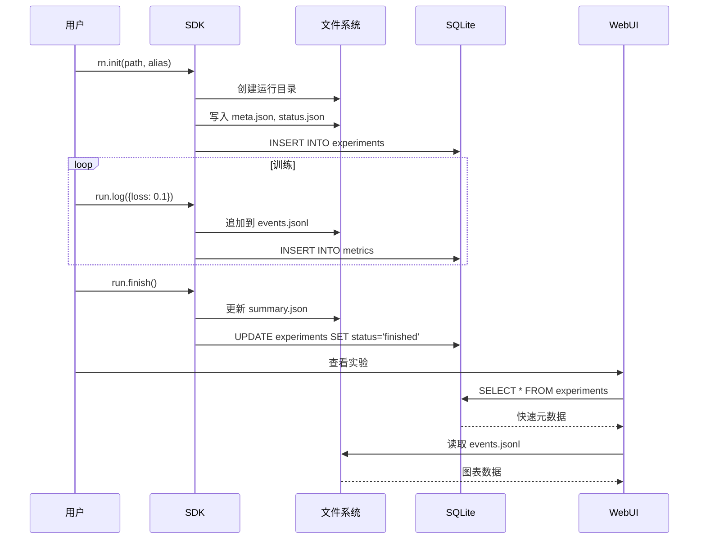

[English](../en/DATA_FLOW.md) | [简体中文](DATA_FLOW.md)

---

# 数据流架构

**文档类型**: 架构
**目的**: 记录数据如何流经 Runicorn 系统

---

## 实验生命周期流程


```mermaid
sequenceDiagram
    participant 用户
    participant SDK
    participant 文件系统
    participant SQLite
    participant WebUI

    用户->>SDK: rn.init(path, alias)
    SDK->>文件系统: 创建运行目录
    SDK->>文件系统: 写入 meta.json, status.json
    SDK->>SQLite: INSERT INTO experiments

    loop 训练
        用户->>SDK: run.log({loss: 0.1})
        SDK->>文件系统: 追加到 events.jsonl
        SDK->>SQLite: INSERT INTO metrics
    end

    用户->>SDK: run.finish()
    SDK->>文件系统: 更新 summary.json
    SDK->>SQLite: UPDATE experiments SET status='finished'

    用户->>WebUI: 查看实验
    WebUI->>SQLite: SELECT * FROM experiments
    SQLite-->>WebUI: 快速元数据
    WebUI->>文件系统: 读取 events.jsonl
    文件系统-->>WebUI: 图表数据
```

---

## 指标记录管道

### 逐步流程

**1. 用户记录指标**:
```python
run.log({"loss": 0.5, "accuracy": 0.9}, step=100)
```

**2. SDK 处理**:
```python
# 添加元数据
payload = {
    "loss": 0.5,
    "accuracy": 0.9,
    "global_step": 100,
    "time": current_timestamp
}

# 写入文件（V1 兼容）
events_file.append(json.dumps(payload))

# 写入 SQLite（V2 性能）
for metric_name, value in payload.items():
    metrics_table.insert(exp_id, metric_name, value, step)
```

**3. Web UI 检索**:
```python
# V1: 解析 JSONL 文件
metrics = parse_jsonl(events_file)

# V2: 查询 SQLite（快 100 倍）
metrics = SELECT * FROM metrics WHERE experiment_id = ? ORDER BY step
```

---

## 运行资产记录流程

### 序列

```
1. 用户调用 `run.log_config()`、`run.log_dataset()`、`run.log_pretrained()`
   或 `snapshot_workspace()`
   ↓
2. SDK 规范化元数据，并判断是否需要归档内容
   ↓
3. 对需要保存的文件/目录：
   - 计算指纹 / SHA256
   - 尽量复用已有 blob 或 manifest
   - 写入或链接到 `archive/`
   ↓
4. 更新运行目录中的 `assets.json`
   ↓
5. 启用现代存储时，同步 SQLite `assets` + `run_assets`
   ↓
6. Viewer 通过 `/api/runs/{run_id}/assets` 暴露结果
```

### 去重决策树

```
要归档的文件或目录
    ↓
计算指纹 / SHA256
    ↓
检查：是否已有匹配的 blob / manifest？
    ├─ 是 → 复用已有归档条目
    │         （不重复写入）
    └─ 否 → 写入 `archive/blobs` 或 `archive/manifests`
              ↓
              在 `assets.json` 中记录 `archive_path`
              ↓
              在可用时建立 run ↔ asset 的 SQLite 关联
```

---

## 远程同步流程

### 智能模式（仅元数据）

```
┌─────────────┐         SSH/SFTP        ┌──────────────┐
│ 本地        │ ◄──────────────────────►│ 远程         │
│ 机器        │                          │ 服务器       │
└─────────────┘                          └──────────────┘

步骤 1: 通过 SSH 连接
本地 ──[SSH 认证]──► 远程
      ◄──[已连接]──

步骤 2: 列出远程结构
本地 ──[SFTP ls]──────► 远程
      ◄──[目录列表]──

步骤 3: 同步元数据（仅 JSON 文件）
本地 ──[SFTP get *.json]──► 远程
      ◄──[200MB 元数据]───

步骤 4: 本地缓存
本地: 保存到 ~/.runicorn_remote_cache/
       ├── metadata/
       └── index.db

步骤 5: 用户查询（从缓存，即时）
用户 → WebUI → 缓存 → 显示（无网络）

步骤 6: 按需下载文件
用户点击"下载"
   ↓
本地 ──[SFTP get model.pth]──► 远程
      ◄──[8GB 文件传输]───
   ↓
保存到 cache/downloads/
```

---

## WebSocket 日志流

### 实时流程

```
训练进程             后端              前端
      │                      │                     │
      │ 写入 logs.txt        │                     │
      ├──────────────────────►                     │
      │                      │                     │
      │                      │ tail -f logs.txt    │
      │                      ├─────────────────────► WebSocket
      │                      │                     │ 连接
      │                      │ 新行事件            │
      │                      ├─────────────────────►
      │                      │                     │ 在 UI
      │                      │                     │ 中显示
```

### 实现

**后端**（FastAPI WebSocket）:
```python
@app.websocket("/runs/{run_id}/logs/ws")
async def logs_websocket(websocket, run_id):
    await websocket.accept()

    log_file = get_log_path(run_id)

    with open(log_file) as f:
        # 发送现有日志
        for line in f:
            await websocket.send_text(line)

        # 跟踪新行
        while True:
            line = f.readline()
            if line:
                await websocket.send_text(line)
            else:
                await asyncio.sleep(0.1)
```

**前端**（React）:
```javascript
const ws = new WebSocket('ws://localhost:23300/api/runs/{id}/logs/ws')

ws.onmessage = (event) => {
    setLogs(prev => [...prev, event.data])
}
```

---

## 资产查看与下载流程

### 加载和使用

```
1. 用户打开 Run Detail 或 Assets 页面
   ↓
2. 前端请求 `/api/runs/{run_id}/assets`
   ↓
3. 后端读取 `assets.json`（必要时结合资产索引）
   ↓
4. UI 按 code / config / dataset / pretrained / output 分组展示
   ↓
5. 用户预览或下载某个条目
   ↓
6. 前端调用 `/api/runs/{run_id}/assets/download?path=...`
   ↓
7. 后端按运行目录 / 关联归档校验绝对路径
   ↓
8. 将文件或 ZIP 响应流式返回浏览器
```

### 共享资产引用检查

```
回收站预览：
GET /api/runs/{run_id}/assets/refs
    ↓
响应：
{
  "orphaned_assets": [
    {"asset_id": "...", "asset_type": "dataset", "ref_count": 1}
  ],
  "shared_assets": [
    {"asset_id": "...", "asset_type": "pretrained", "ref_count": 3}
  ]
}
    ↓
回收站 UI 展示永久删除时会删除哪些资产、保留哪些共享资产
```

---

## 查询优化流程

### V1 API（文件扫描）

```
GET /api/runs
    ↓
扫描目录
    ├─ project1/
    │  └─ name1/runs/* (100 个运行)
    ├─ project2/
    │  └─ name2/runs/* (500 个运行)
    ↓
读取 JSON 文件（每个运行 3-4 个）
    ↓
解析和聚合
    ↓
5-10 秒后返回
```

### 当前 SQLite 支撑的列表流

```
GET /api/paths/runs?path=X&exact=false
    ↓
先从 SQLite 支撑的 experiments 表读取活动 runs
    ↓
SELECT * FROM experiments
WHERE deleted_at IS NULL
ORDER BY created_at DESC
    ↓
再按路径前缀过滤
    ↓
典型数据量下可在 50-100 毫秒内返回
```

---

## 缓存策略

### 指标缓存

```
首次请求:
用户 → API → 解析 events.jsonl → 缓存结果 → 返回
                      (300毫秒)

后续请求（60秒内）:
用户 → API → 检查缓存 → 返回缓存
                  (5毫秒，快 60 倍)

缓存失效:
- TTL: 60 秒
- 或: 记录新指标时
```

### 连接池

```
请求 1 → 从池获取连接 → 执行 → 返回到池
请求 2 → 复用连接 → 执行 → 返回到池
...
请求 10 → 全部复用 10 个池化连接

优势:
- 无连接设置开销
- 线程安全访问
- 自动清理
```

---

## 错误传播

### 从存储到用户

```
存储层错误
    ↓
业务逻辑捕获
    ↓
映射到 HTTP 状态
    ↓
API 返回 JSON 错误
    ↓
前端显示用户友好消息
```

**示例**:
```python
# 存储
raise FileNotFoundError("Run directory not found")

# 业务逻辑
except FileNotFoundError:
    raise HTTPException(404, "Run not found")

# API 响应
{"detail": "Run not found"}

# 前端
message.error("实验未找到")
```

---

## Remote Viewer 数据流

### 连接建立流程

```
用户（浏览器）
    ↓
点击"连接远程服务器"
    ↓
本地 Viewer API
    ↓
Connection Manager: 建立 SSH 连接
    ├─ 密码认证 / SSH 密钥
    ├─ Keep-alive 设置
    └─ 连接池添加
    ↓
Environment Detector: 扫描远程环境
    ├─ 执行: conda env list
    ├─ 执行: which python
    ├─ 对每个环境: import runicorn
    └─ 返回兼容环境列表
    ↓
返回连接状态和环境列表给前端
```

### Remote Viewer 启动流程

```
用户选择环境
    ↓
POST /api/remote/viewer/start
    ↓
Viewer Launcher: 构建启动命令
    ↓
通过 SSH 执行:
    source /path/to/env/bin/activate && \
    runicorn viewer --host 127.0.0.1 --port 23300 --no-open-browser &
    ↓
获取进程 PID
    ↓
Tunnel Manager: 创建 SSH 隧道
    ├─ 远程: 127.0.0.1:23300
    └─ 本地: 127.0.0.1:8081
    ↓
Health Checker: 验证 Viewer 启动
    ├─ 测试连接: socket.connect(('127.0.0.1', 8081))
    └─ HTTP 检查: GET http://localhost:8081/api/health
    ↓
返回 Viewer URL: http://localhost:8081
    ↓
前端自动打开新标签页
```

### 数据访问流程

```
浏览器请求
    ↓
http://localhost:8081/api/runs
    ↓
本地 SSH 隧道
    ↓
转发到远程: 127.0.0.1:23300
    ↓
远程 Viewer 实例（FastAPI）
    ↓
读取远程数据存储
    ├─ runicorn.db (SQLite)
    └─ ~/RunicornData/project/name/runs/
    ↓
返回 JSON 响应
    ↓
通过 SSH 隧道返回
    ↓
浏览器接收并渲染
```

### 实时日志流（Remote）

```
浏览器建立 WebSocket
    ↓
ws://localhost:8081/api/runs/{id}/logs/ws
    ↓
本地 SSH 隧道（WebSocket 升级）
    ↓
转发到远程 Viewer
    ↓
远程 Viewer 读取日志文件
    ├─ tail -f /path/to/logs.txt
    └─ 持续流式传输
    ↓
通过 SSH 隧道流式返回
    ↓
浏览器实时显示日志
```

### 健康检查流程

```
定时器（每 30 秒）
    ↓
Health Checker 执行检查
    ├─ 1. 连接检查
    │   └─ SSH: echo "ping"
    ├─ 2. Viewer 检查
    │   └─ HTTP: GET http://localhost:8081/api/health
    └─ 3. 隧道检查
        └─ socket.connect(('127.0.0.1', 8081))
    ↓
如果任何检查失败:
    ├─ 尝试自动恢复
    │   ├─ SSH 断开: 重连（最多 3 次）
    │   ├─ Viewer 崩溃: 通知用户
    │   └─ 隧道断开: 重建隧道
    └─ 更新健康状态
    ↓
前端显示连接状态指示器
```

### 断开连接清理流程

```
用户点击断开 / 关闭标签页
    ↓
POST /api/remote/viewer/stop
{"session_id": "{session_id}"}
    ↓
若该 SSH 连接下已无其它 Viewer session:
POST /api/remote/disconnect
{"host": "...", "port": 22, "username": "..."}
    ↓
清理步骤:
    ├─ 1. Tunnel Manager: 关闭 SSH 隧道
    │   └─ 停止转发线程
    ├─ 2. Viewer Launcher: 停止远程 Viewer
    │   ├─ 通过 SSH: kill {pid}
    │   └─ 删除日志文件
    └─ 3. Connection Manager: 关闭 SSH 连接
        └─ 从连接池移除
    ↓
返回清理状态
    ↓
前端更新 UI，移除连接
```

---

**相关文档**: [COMPONENT_ARCHITECTURE.md](COMPONENT_ARCHITECTURE.md) | [STORAGE_DESIGN.md](STORAGE_DESIGN.md) | [REMOTE_VIEWER_ARCHITECTURE.md](REMOTE_VIEWER_ARCHITECTURE.md)

**返回**: [架构索引](README.md)

