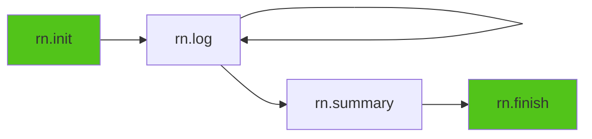

# Python SDK Overview

The Runicorn Python SDK provides a simple, intuitive API for tracking ML experiments.

---

## Core Concepts

### Experiment Lifecycle



Every experiment follows this lifecycle:

1. **Initialize** - Create new experiment
2. **Log** - Record metrics during training
3. **Summary** - Save final results
4. **Finish** - Mark as complete

---

## Essential Functions

### `rn.init()` - Initialize Experiment

Create a new experiment run.

**Signature**:
```python
def init(
    project: str = "default",
    name: str = None,
    storage: str = None,
    run_id: str = None,
    capture_env: bool = True
) -> Run
```

**Parameters**:

| Parameter | Type | Default | Description |
|-----------|------|---------|-------------|
| `project` | str | "default" | Project name (like a folder) |
| `name` | str | "default" | Experiment name (like sub-folder) |
| `storage` | str | None | Storage root path (overrides config) |
| `run_id` | str | None | Custom run ID (auto-generated if None) |
| `capture_env` | bool | True | Capture Git info, dependencies, system info |

**Returns**: `Run` object

**Example**:
```python
import runicorn as rn

# Simple
run = rn.init(project="demo")

# With name
run = rn.init(project="image_classification", name="resnet50_v1")

# With custom storage
run = rn.init(project="demo", storage="E:\\MLData")

# Without environment capture (faster)
run = rn.init(project="demo", capture_env=False)
```

---

### `rn.log()` - Log Metrics

Record training metrics at each step.

**Signature**:
```python
def log(
    data: dict = None,
    step: int = None,
    stage: str = None,
    **kwargs
) -> None
```

**Parameters**:

| Parameter | Type | Description |
|-----------|------|-------------|
| `data` | dict | Dictionary of metric names and values |
| `step` | int | Training step (auto-increments if not provided) |
| `stage` | str | Training stage: "warmup", "train", "eval", etc. |
| `**kwargs` | any | Additional metrics as keyword arguments |

**Example**:
```python
import runicorn as rn

run = rn.init(project="demo")

# Simple logging
rn.log({"loss": 0.5, "accuracy": 0.8}, step=10)

# Auto-incrementing step
rn.log({"loss": 0.4})  # step=1
rn.log({"loss": 0.3})  # step=2

# With stage
rn.log({"loss": 0.2}, stage="train")
rn.log({"val_loss": 0.3}, stage="eval")

# Using kwargs
rn.log(loss=0.1, accuracy=0.95, lr=0.001, step=100)

# Mixed
rn.log({"loss": 0.1}, accuracy=0.95, step=100)

rn.finish()
```

---

### `rn.log_text()` - Log Text Messages

Log text messages and progress updates.

**Signature**:
```python
def log_text(text: str) -> None
```

**Example**:
```python
import runicorn as rn

run = rn.init(project="demo")

rn.log_text("Starting training...")
rn.log_text(f"Epoch 1/100, loss=0.5")
rn.log_text("✓ Training completed")

rn.finish()
```

---

### `rn.log_image()` - Log Images

Log images for visualization.

**Signature**:
```python
def log_image(
    key: str,
    image: Any,
    step: int = None,
    caption: str = None,
    format: str = "png",
    quality: int = 90
) -> str
```

**Parameters**:

| Parameter | Type | Description |
|-----------|------|-------------|
| `key` | str | Image identifier/name |
| `image` | PIL.Image, np.ndarray, bytes, or path | Image to log |
| `step` | int | Training step |
| `caption` | str | Image caption |
| `format` | str | Image format: "png", "jpg" |
| `quality` | int | JPEG quality (1-100) |

**Example**:
```python
import runicorn as rn
from PIL import Image
import numpy as np

run = rn.init(project="demo")

# From PIL Image
img = Image.open("prediction.png")
rn.log_image("prediction", img, step=100, caption="Model prediction")

# From numpy array
array = np.random.rand(224, 224, 3) * 255
rn.log_image("sample", array.astype(np.uint8), step=100)

# From file path
rn.log_image("result", "output.jpg", step=100)

rn.finish()
```

---

### `rn.set_primary_metric()` - Track Best Value

Set which metric to track automatically.

**Signature**:
```python
def set_primary_metric(
    metric_name: str,
    mode: str = "max"
) -> None
```

**Parameters**:

| Parameter | Type | Description |
|-----------|------|-------------|
| `metric_name` | str | Metric to track (e.g., "accuracy", "loss") |
| `mode` | str | "max" (higher is better) or "min" (lower is better) |

**Example**:
```python
import runicorn as rn

run = rn.init(project="demo")

# Track best accuracy
rn.set_primary_metric("accuracy", mode="max")

# Training loop
for step in range(100):
    acc = train_step()  # Your training code
    rn.log({"accuracy": acc}, step=step)

# Best accuracy is automatically saved to summary
rn.finish()
```

**Automatic tracking**: The best value and its step are automatically saved to `summary.json`.

---

### `rn.summary()` - Save Summary

Record final results and metadata.

**Signature**:
```python
def summary(update: dict) -> None
```

**Example**:
```python
import runicorn as rn

run = rn.init(project="demo")

# Training...
for step in range(100):
    rn.log({"loss": 0.1}, step=step)

# Save final results
rn.summary({
    "final_accuracy": 0.95,
    "final_loss": 0.05,
    "total_epochs": 100,
    "dataset": "CIFAR-10",
    "model": "ResNet50",
    "notes": "Baseline experiment with default hyperparameters"
})

rn.finish()
```

---

### `rn.finish()` - Complete Experiment

Mark experiment as finished.

**Signature**:
```python
def finish(status: str = "finished") -> None
```

**Parameters**:

| Parameter | Type | Default | Description |
|-----------|------|---------|-------------|
| `status` | str | "finished" | Final status: "finished", "failed", "interrupted" |

**Example**:
```python
import runicorn as rn

run = rn.init(project="demo")

try:
    # Training code
    for step in range(100):
        rn.log({"loss": 0.1}, step=step)
    
    # Success
    rn.finish(status="finished")
    
except KeyboardInterrupt:
    # User interrupted
    rn.finish(status="interrupted")
    
except Exception as e:
    # Training failed
    rn.log_text(f"Error: {e}")
    rn.finish(status="failed")
```

---

## Complete Example

Here's a complete experiment tracking a real PyTorch model:

```python
import runicorn as rn
import torch
import torch.nn as nn
import torch.optim as optim
from torchvision import datasets, transforms

# Initialize
run = rn.init(
    project="image_classification",
    name="mnist_cnn",
    capture_env=True  # Capture Git, pip packages, system info
)

rn.log_text("Starting MNIST training...")
rn.set_primary_metric("test_accuracy", mode="max")

# Define model
model = nn.Sequential(
    nn.Conv2d(1, 32, 3, 1),
    nn.ReLU(),
    nn.MaxPool2d(2),
    nn.Flatten(),
    nn.Linear(5408, 10)
)

optimizer = optim.Adam(model.parameters(), lr=0.001)
criterion = nn.CrossEntropyLoss()

# Load data
train_loader = torch.utils.data.DataLoader(
    datasets.MNIST('./data', train=True, download=True,
                   transform=transforms.ToTensor()),
    batch_size=64, shuffle=True
)

# Training loop
for epoch in range(10):
    model.train()
    total_loss = 0
    
    for batch_idx, (data, target) in enumerate(train_loader):
        optimizer.zero_grad()
        output = model(data)
        loss = criterion(output, target)
        loss.backward()
        optimizer.step()
        
        total_loss += loss.item()
        
        # Log every 100 batches
        if batch_idx % 100 == 0:
            rn.log({
                "train_loss": loss.item(),
                "learning_rate": optimizer.param_groups[0]['lr']
            }, stage="train")
    
    # Log epoch metrics
    avg_loss = total_loss / len(train_loader)
    rn.log({"epoch_loss": avg_loss}, step=epoch)
    rn.log_text(f"Epoch {epoch+1}/10, loss={avg_loss:.4f}")

# Save model
torch.save(model.state_dict(), "mnist_model.pth")

# Save as artifact
artifact = rn.Artifact("mnist-cnn", type="model")
artifact.add_file("mnist_model.pth")
artifact.add_metadata({
    "architecture": "Simple CNN",
    "epochs": 10,
    "optimizer": "Adam",
    "dataset": "MNIST"
})

version = run.log_artifact(artifact)
rn.log_text(f"Model saved as v{version}")

# Summary
rn.summary({
    "final_loss": avg_loss,
    "total_epochs": 10,
    "model_path": "mnist_model.pth"
})

rn.finish()
print(f"✓ Experiment completed: {run.id}")
```

**Then view in browser**: `runicorn viewer` → [http://127.0.0.1:23300](http://127.0.0.1:23300)

---

## Common Patterns

### Pattern 1: Simple Training Loop

```python
import runicorn as rn

run = rn.init(project="demo", name="simple_training")
rn.set_primary_metric("accuracy", mode="max")

for epoch in range(100):
    # Your training code
    loss, acc = train_one_epoch(model)
    
    # Log metrics
    rn.log({"loss": loss, "accuracy": acc}, step=epoch)

rn.finish()
```

### Pattern 2: Multi-Stage Training

```python
import runicorn as rn

run = rn.init(project="demo")

# Warmup stage
for step in range(10):
    rn.log({"loss": 1.0}, step=step, stage="warmup")

# Training stage
for step in range(10, 100):
    rn.log({"loss": 0.5}, step=step, stage="train")

# Evaluation stage
for step in range(100, 110):
    rn.log({"val_loss": 0.3}, step=step, stage="eval")

rn.finish()
```

### Pattern 3: Checkpoint Saving

```python
import runicorn as rn
import torch

run = rn.init(project="training")

for epoch in range(100):
    train_one_epoch(model)
    
    # Save checkpoint every 10 epochs
    if epoch % 10 == 0:
        # Save model
        checkpoint_path = f"checkpoint_epoch{epoch}.pth"
        torch.save(model.state_dict(), checkpoint_path)
        
        # Save as artifact
        artifact = rn.Artifact(f"model-checkpoint", type="model")
        artifact.add_file(checkpoint_path)
        artifact.add_metadata({"epoch": epoch})
        
        version = run.log_artifact(artifact)
        rn.log_text(f"Checkpoint saved as v{version}")

rn.finish()
```

---

## Best Practices

!!! tip "Tip: Organize Your Projects"

    Use a clear project/name hierarchy:
    
    ```python
    # Good
    rn.init(project="image_classification", name="resnet50_baseline")
    rn.init(project="image_classification", name="resnet50_augmented")
    rn.init(project="nlp", name="bert_finetuning")
    
    # Avoid
    rn.init(project="test", name="exp1")  # Not descriptive
    ```

!!! tip "Tip: Set Primary Metric"

    Always set a primary metric for easy comparison:
    
    ```python
    rn.set_primary_metric("accuracy", mode="max")
    # Now best accuracy is automatically tracked
    ```

!!! warning "Remember to call finish()"

    Always call `rn.finish()` at the end to ensure data is saved:
    
    ```python
    run = rn.init(project="demo")
    try:
        # Training code
        rn.log({"loss": 0.1})
    finally:
        rn.finish()  # Always called, even if error occurs
    ```

---

## Next Steps

- More SDK documentation coming soon
- For complete API reference, see the inline documentation in code
- For examples, see [Image Classification Tutorial](../tutorials/image-classification.md)

---

## Quick Reference

```python
import runicorn as rn

# Initialize
run = rn.init(project="demo", name="exp1")

# Set primary metric
rn.set_primary_metric("accuracy", mode="max")

# Log metrics
rn.log({"loss": 0.1, "accuracy": 0.95}, step=100, stage="train")

# Log text
rn.log_text("Training started")

# Log image
rn.log_image("prediction", image_array, step=100)

# Save artifact
artifact = rn.Artifact("my-model", type="model")
artifact.add_file("model.pth")
run.log_artifact(artifact)

# Summary
rn.summary({"final_accuracy": 0.95})

# Finish
rn.finish()
```

---

<div align="center">
  <p><a href="experiment-tracking.md">Learn More About Experiment Tracking →</a></p>
</div>

