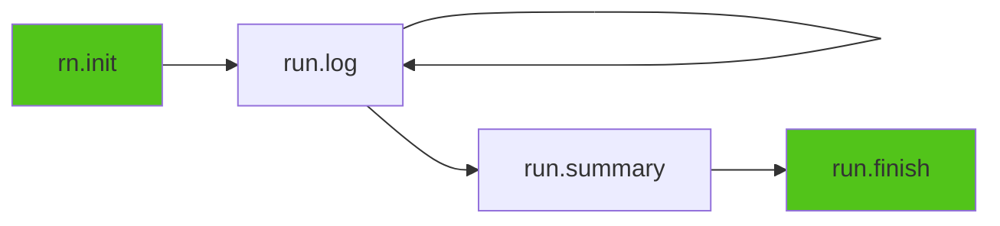

# Python SDK Overview

The Runicorn Python SDK provides a simple, intuitive API for tracking ML experiments.

---

## Core Concepts

### Experiment Lifecycle



Every experiment follows this lifecycle:

1. **Initialize** - Create new experiment with `rn.init()`
2. **Log** - Record metrics during training
3. **Summary** - Save final results
4. **Finish** - Mark as complete

---

## Essential Functions

### `rn.init()` - Initialize Experiment

Create a new experiment run.

**Signature**:
```python
def init(
    path: str = None,
    storage: str = None,
    run_id: str = None,
    alias: str = None,
    capture_env: bool = False,
    snapshot_code: bool = False,
    workspace_root: str = None,
    snapshot_format: str = "zip",
    force_snapshot: bool = False,
    capture_console: bool = False,
    tqdm_mode: str = "smart"
) -> Run
```

**Key Parameters**:

- `path` — Experiment path hierarchy (e.g., `"cv/resnet50/baseline"`). Defaults to `"default"`
- `storage` — Storage root path (overrides config)
- `alias` — User-friendly alias for this run
- `capture_env` — Capture system/environment info (default: `False`)
- `snapshot_code` — Snapshot workspace code automatically (default: `False`)
- `capture_console` — Capture stdout/stderr to logs.txt (default: `False`)
- `tqdm_mode` — tqdm handling: `"smart"` (default), `"all"`, `"none"`

**Returns**: `Run` object (or `NoOpRun` if tracking is disabled)

**Example**:
```python
import runicorn as rn

# Simple
run = rn.init(path="demo")

# With path hierarchy
run = rn.init(path="cv/resnet50/baseline")

# With alias
run = rn.init(path="cv/resnet50/v2", alias="best-model")

# With custom storage
run = rn.init(path="demo", storage="E:\\MLData")

# With code snapshot
run = rn.init(path="demo", snapshot_code=True)

# With console capture
run = rn.init(path="demo", capture_console=True, tqdm_mode="smart")
```

---

### `run.log()` - Log Metrics

Record training metrics at each step.

**Signature**:
```python
def log(
    data: dict = None,
    *,
    step: int = None,
    stage: str = None,
    **kwargs
) -> None
```

**Parameters**:

- `data` — Dictionary of metric names and values
- `step` — Training step (auto-increments if not provided)
- `stage` — Training stage: `"warmup"`, `"train"`, `"eval"`, etc.
- `**kwargs` — Additional metrics as keyword arguments

**Example**:
```python
import runicorn as rn

run = rn.init(path="demo")

# Simple logging
run.log({"loss": 0.5, "accuracy": 0.8}, step=10)

# Auto-incrementing step
run.log({"loss": 0.4})  # step=1
run.log({"loss": 0.3})  # step=2

# With stage
run.log({"loss": 0.2}, stage="train")
run.log({"val_loss": 0.3}, stage="eval")

# Using kwargs
run.log(loss=0.1, accuracy=0.95, lr=0.001, step=100)

run.finish()
```

---

### `run.log_text()` - Log Text Messages

Log text messages and progress updates to `logs.txt`.

**Signature**:
```python
def log_text(text: str) -> None
```

**Example**:
```python
run.log_text("Starting training...")
run.log_text(f"Epoch 1/100, loss=0.5")
run.log_text("✓ Training completed")
```

---

### `run.get_logging_handler()` - Python Logging Integration

Get a logging handler to integrate with Python's logging module.

**Signature**:
```python
def get_logging_handler(
    level: int = logging.INFO,
    fmt: str = None
) -> RunicornLoggingHandler
```

**Parameters**:

- `level` — Minimum log level (default: `logging.INFO`)
- `fmt` — Custom format string (optional)

**Example**:
```python
import runicorn as rn
import logging

run = rn.init(path="demo")

logger = logging.getLogger(__name__)
logger.addHandler(run.get_logging_handler())
logger.setLevel(logging.INFO)

logger.info("Training started")    # Saved to logs.txt
logger.warning("LR is high")      # Saved to logs.txt

run.finish()
```

---

### `run.log_image()` - Log Images

Log images for visualization.

**Signature**:
```python
def log_image(
    key: str,
    image: Any,
    step: int = None,
    caption: str = None,
    format: str = "png",
    quality: int = 90
) -> str
```

**Parameters**:

- `key` — Image identifier/name
- `image` — PIL.Image, numpy array, bytes, or file path
- `step` — Training step
- `caption` — Image caption
- `format` — Image format: `"png"`, `"jpg"`
- `quality` — JPEG quality (1-100)

**Example**:
```python
import runicorn as rn
from PIL import Image
import numpy as np

run = rn.init(path="demo")

# From PIL Image
img = Image.open("prediction.png")
run.log_image("prediction", img, step=100, caption="Model prediction")

# From numpy array
array = np.random.rand(224, 224, 3) * 255
run.log_image("sample", array.astype(np.uint8), step=100)

# From file path
run.log_image("result", "output.jpg", step=100)

run.finish()
```

---

### `run.set_primary_metric()` - Track Best Value

Set which metric to track automatically.

**Signature**:
```python
def set_primary_metric(metric_name: str, mode: str = "max") -> None
```

**Parameters**:

- `metric_name` — Metric to track (e.g., `"accuracy"`, `"loss"`)
- `mode` — `"max"` (higher is better) or `"min"` (lower is better)

**Example**:
```python
run = rn.init(path="demo")
run.set_primary_metric("accuracy", mode="max")

for step in range(100):
    acc = train_step()
    run.log({"accuracy": acc}, step=step)

# Best accuracy is automatically saved to summary
run.finish()
```

---

### `run.log_config()` - Log Configuration

Record experiment configuration, CLI arguments, and config files.

**Signature**:
```python
def log_config(
    *,
    args: Any = None,
    extra: dict = None,
    config_files: list[str | Path] = None
) -> None
```

**Example**:
```python
import argparse
import runicorn as rn

parser = argparse.ArgumentParser()
parser.add_argument("--lr", type=float, default=0.001)
parser.add_argument("--epochs", type=int, default=100)
args = parser.parse_args()

run = rn.init(path="demo")

# Log argparse args + extra config + config file paths
run.log_config(
    args=args,
    extra={"model": "ResNet50", "dataset": "CIFAR-10"},
    config_files=["config.yaml"]
)

run.finish()
```

---

### `run.log_dataset()` - Log Dataset Information

Record dataset metadata with optional archiving.

**Signature**:
```python
def log_dataset(
    name: str,
    root_or_uri: str | Path | dict,
    *,
    context: str = "train",
    save: bool = False,
    description: str = None,
    force_save: bool = False,
    max_archive_bytes: int = 5 * 1024**3,
    max_archive_files: int = 2_000_000
) -> None
```

**Example**:
```python
run = rn.init(path="cv/resnet50")

# Log dataset metadata (no copy)
run.log_dataset("cifar10", "./data/cifar10", context="train", description="CIFAR-10 training set")

# Log and archive dataset
run.log_dataset("config", "./configs", context="config", save=True)

run.finish()
```

---

### `run.log_pretrained()` - Log Pretrained Model

Record pretrained model information with optional archiving.

**Signature**:
```python
def log_pretrained(
    name: str,
    *,
    path_or_uri: str | Path | dict = None,
    save: bool = False,
    source_type: str = "unknown",
    description: str = None,
    force_save: bool = False
) -> None
```

**Example**:
```python
run = rn.init(path="nlp/bert-finetuning")

# Log HuggingFace model reference
run.log_pretrained(
    "bert-base",
    path_or_uri="bert-base-uncased",
    source_type="huggingface",
    description="BERT base model (uncased)"
)

# Log and archive local checkpoint
run.log_pretrained(
    "my-checkpoint",
    path_or_uri="./checkpoints/best.pth",
    save=True,
    source_type="local"
)

run.finish()
```

---

### `run.summary()` - Save Summary

Record final results and metadata.

**Signature**:
```python
def summary(update: dict) -> None
```

**Example**:
```python
run.summary({
    "final_accuracy": 0.95,
    "final_loss": 0.05,
    "total_epochs": 100,
    "model": "ResNet50",
    "notes": "Baseline with default hyperparameters"
})
```

---

### `run.finish()` - Complete Experiment

Mark experiment as finished.

**Signature**:
```python
def finish(status: str = "finished") -> None
```

**Parameters**:

- `status` — Final status: `"finished"`, `"failed"`, `"interrupted"`

**Example**:
```python
try:
    for step in range(100):
        run.log({"loss": 0.1}, step=step)
    run.finish(status="finished")
except KeyboardInterrupt:
    run.finish(status="interrupted")
except Exception as e:
    run.log_text(f"Error: {e}")
    run.finish(status="failed")
```

---

### Context Manager

Use `Run` as a context manager for automatic finish:

```python
import runicorn as rn

with rn.init(path="demo") as run:
    run.log({"loss": 0.5}, step=1)
    run.log({"loss": 0.3}, step=2)
# Automatically calls run.finish()
# If exception occurs, status is set to "failed"
```

---

### `rn.enabled()` / `rn.set_enabled()` - Toggle Tracking

Disable/enable tracking globally (useful for debugging or inference):

```python
import runicorn as rn

# Disable tracking
rn.set_enabled(False)

run = rn.init(path="demo")  # Returns NoOpRun (no-op, zero overhead)
run.log({"loss": 0.1})      # Does nothing
run.finish()                 # Does nothing

# Re-enable
rn.set_enabled(True)

# Check status
print(rn.is_enabled())  # True
```

---

## Complete Example

```python
import runicorn as rn
import torch
import torch.nn as nn
import torch.optim as optim
from torchvision import datasets, transforms

# Initialize with code snapshot and console capture
run = rn.init(
    path="cv/mnist/cnn_baseline",
    snapshot_code=True,
    capture_console=True,
    tqdm_mode="smart"
)

run.log_text("Starting MNIST training...")
run.set_primary_metric("test_accuracy", mode="max")

# Log config
run.log_config(extra={
    "model": "SimpleCNN",
    "epochs": 10,
    "optimizer": "Adam",
    "lr": 0.001
})

# Log dataset
run.log_dataset("mnist", "./data", context="train")

# Define model
model = nn.Sequential(
    nn.Conv2d(1, 32, 3, 1), nn.ReLU(), nn.MaxPool2d(2),
    nn.Flatten(), nn.Linear(5408, 10)
)
optimizer = optim.Adam(model.parameters(), lr=0.001)
criterion = nn.CrossEntropyLoss()

train_loader = torch.utils.data.DataLoader(
    datasets.MNIST('./data', train=True, download=True,
                   transform=transforms.ToTensor()),
    batch_size=64, shuffle=True
)

# Training loop
for epoch in range(10):
    model.train()
    total_loss = 0
    for data, target in train_loader:
        optimizer.zero_grad()
        loss = criterion(model(data), target)
        loss.backward()
        optimizer.step()
        total_loss += loss.item()
    
    avg_loss = total_loss / len(train_loader)
    run.log({"epoch_loss": avg_loss}, step=epoch)
    run.log_text(f"Epoch {epoch+1}/10, loss={avg_loss:.4f}")

# Summary
run.summary({
    "final_loss": avg_loss,
    "total_epochs": 10,
    "model_path": "mnist_model.pth"
})

run.finish()
print(f"✓ Experiment completed: {run.id}")
```

**Then view in browser**: `runicorn viewer` → [http://127.0.0.1:23300](http://127.0.0.1:23300)

---

## Common Patterns

### Pattern 1: Simple Training Loop

```python
import runicorn as rn

run = rn.init(path="cv/resnet50/baseline")
run.set_primary_metric("accuracy", mode="max")

for epoch in range(100):
    loss, acc = train_one_epoch(model)
    run.log({"loss": loss, "accuracy": acc}, step=epoch)

run.finish()
```

### Pattern 2: Multi-Stage Training

```python
import runicorn as rn

run = rn.init(path="training/multi-stage")

for step in range(10):
    run.log({"loss": 1.0}, step=step, stage="warmup")

for step in range(10, 100):
    run.log({"loss": 0.5}, step=step, stage="train")

for step in range(100, 110):
    run.log({"val_loss": 0.3}, step=step, stage="eval")

run.finish()
```

### Pattern 3: Context Manager with Error Handling

```python
import runicorn as rn

with rn.init(path="training/safe") as run:
    run.set_primary_metric("loss", mode="min")
    
    for epoch in range(100):
        loss = train_one_epoch(model)
        run.log({"loss": loss}, step=epoch)
    
    run.summary({"final_loss": loss})
# Automatically finishes — "failed" if exception, "finished" otherwise
```

---

## Best Practices

!!! tip "Tip: Organize with Path Hierarchy"

    Use descriptive, hierarchical paths:
    
    ```python
    # Good
    rn.init(path="cv/classification/resnet50/baseline")
    rn.init(path="cv/classification/resnet50/augmented")
    rn.init(path="nlp/sentiment/bert-finetuning")
    
    # Avoid
    rn.init(path="test")  # Not descriptive
    ```

!!! tip "Tip: Set Primary Metric"

    Always set a primary metric for easy comparison:
    
    ```python
    run.set_primary_metric("accuracy", mode="max")
    ```

!!! warning "Remember to call finish()"

    Always call `run.finish()` or use the context manager:
    
    ```python
    # Option 1: try/finally
    run = rn.init(path="demo")
    try:
        run.log({"loss": 0.1})
    finally:
        run.finish()
    
    # Option 2: context manager (recommended)
    with rn.init(path="demo") as run:
        run.log({"loss": 0.1})
    ```

---

## Next Steps

- [Path-based Hierarchy](../getting-started/path-hierarchy.md) — Learn path organization
- [Assets System](../getting-started/assets-system.md) — Workspace snapshots
- [Enhanced Logging](../getting-started/enhanced-logging.md) — Console capture
- [Image Classification Tutorial](../tutorials/image-classification.md) — Complete example

---

## Quick Reference

```python
import runicorn as rn

# Initialize
run = rn.init(path="cv/resnet50/v1", alias="baseline")

# Set primary metric
run.set_primary_metric("accuracy", mode="max")

# Log metrics
run.log({"loss": 0.1, "accuracy": 0.95}, step=100, stage="train")

# Log text
run.log_text("Training started")

# Log image
run.log_image("prediction", image_array, step=100)

# Log config, dataset, pretrained model
run.log_config(args=args, extra={"model": "ResNet50"})
run.log_dataset("cifar10", "./data", context="train")
run.log_pretrained("base-model", path_or_uri="resnet50", source_type="torchvision")

# Summary
run.summary({"final_accuracy": 0.95})

# Finish
run.finish()
```

---

<div align="center">
  <p><a href="../getting-started/path-hierarchy.md">Learn About Path Hierarchy →</a></p>
</div>
