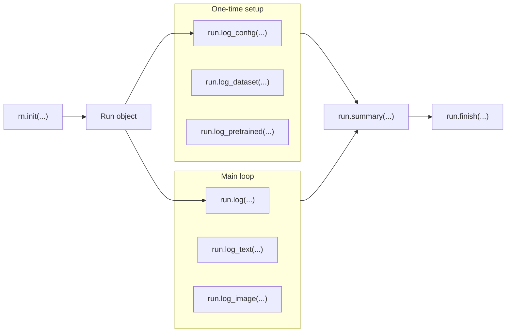

# Python SDK Overview

The Python SDK is the primary way to write data into Runicorn. If you only learn one part of the project, learn this one first.

Runicorn 0.7.0 keeps the SDK small on purpose:

- `rn.init(...)` creates a run
- `run.log(...)` writes metrics
- `run.summary(...)` stores final metadata
- `run.finish(...)` closes the run cleanly

Around that core, the SDK also supports images, text logs, code snapshots, dataset references, pretrained references, and output archiving.

---

## What a run looks like


```mermaid
flowchart LR
    A["rn.init(...)"] --> B["Run object"]

    B --> O1
    B --> L1

    subgraph O["One-time setup"]
        direction TB
        O1["run.log_config(...)"]
        O2["run.log_dataset(...)"]
        O3["run.log_pretrained(...)"]
    end

    subgraph L["Main loop"]
        direction TB
        L1["run.log(...)"]
        L2["run.log_text(...)"]
        L3["run.log_image(...)"]
    end

    O --> S["run.summary(...)"]
    L --> S
    S --> F["run.finish(...)"]
```

In practice, the SDK usually splits into two usage styles:

- one-time calls such as `run.log_config(...)`, `run.log_dataset(...)`, and `run.log_pretrained(...)`
- repeated calls inside the main loop such as `run.log(...)`, plus optional `run.log_text(...)` and `run.log_image(...)`

---

## Which page to read next

| If you want to... | Read this page |
|-------------------|----------------|
| understand the basic lifecycle | [Run Lifecycle](run-lifecycle.md) |
| snapshot code, track datasets, or archive outputs | [Assets & Outputs](assets-and-outputs.md) |
| connect existing logging code with minimal rewrites | [Integrations](integrations.md) |

---

## Core concepts

### 1. A run is the unit of tracking

In Runicorn, a `Run` represents one concrete execution attempt.

You create it with `rn.init(...)`:

```python
run = rn.init(path="cv/resnet50/baseline", alias="seed-42")
```

That run then becomes the object you write everything into:

- metrics
- text logs
- images
- config metadata
- dataset/pretrained references
- summary fields

If you only keep one mental model in mind, use this one:

**one training or evaluation attempt = one `Run` object**

### 2. A run stores three different kinds of information

Most SDK methods make more sense if you group them by the kind of information they record:

| Kind of data | Typical API | Typical usage pattern |
|--------------|-------------|-----------------------|
| timeline data | `run.log(...)`, `run.log_text(...)`, `run.log_image(...)` | repeated during the main loop |
| summary data | `run.summary(...)`, `run.set_primary_metric(...)` | updated occasionally, finalized at the end |
| attached context/assets | `run.log_config(...)`, `run.log_dataset(...)`, `run.log_pretrained(...)`, snapshots, outputs | usually one-time or low-frequency |

This is the real reason the SDK has multiple logging methods: they are not redundant, they describe different shapes of experiment data.

### 3. `path` groups related runs together

`path` is not the contents of a run. It is how multiple runs are organized into a family.

For example:

```python
rn.init(path="cv/classification/resnet50/baseline", alias="seed-42")
rn.init(path="cv/classification/resnet50/baseline", alias="seed-43")
rn.init(path="cv/classification/resnet50/augmented", alias="seed-42")
```

This affects:

- where runs appear in the path tree
- which runs naturally belong together in comparison
- which subtree you export, clean up, or browse

Use `alias`, tags, and `summary()` for run-specific detail instead of stuffing everything into `path`.

See [Path-based Hierarchy](../reference/path-hierarchy.md) for naming patterns, path rules, and team conventions.

### 4. The SDK is local-first

The SDK writes locally under your storage root and the viewer reads that local state later.

That means:

- no account is required
- runs are still normal files on disk
- the Web UI is a browser over local experiment state, not a separate cloud service

---

## Minimal example

```python
import runicorn as rn

run = rn.init(
    path="cv/resnet50/baseline",
    alias="trial-01",
    capture_console=True,
    snapshot_code=True,
) 

run.set_primary_metric("val_acc", mode="max")
run.log_config(extra={"lr": 1e-3, "epochs": 10, "batch_size": 64})
run.log({"train_loss": 0.42, "val_acc": 0.88}, stage="epoch_1")
run.log_text("finished warmup")
run.summary({"notes": "first stable run"})
run.finish()
```

This single block gives you:

- a run directory
- metric history
- a best metric
- captured text logs
- config metadata
- a code snapshot
- a clean final status

---

## Common SDK capabilities

| Task | Main API | Detailed guide |
|------|----------|----------------|
| create a run | [`rn.init(...)`](run-lifecycle.md#sdk-init) | [Run Lifecycle -> `rn.init(...)`](run-lifecycle.md#sdk-init) |
| log scalar metrics | [`run.log(...)`](run-lifecycle.md#sdk-log) | [Run Lifecycle -> `run.log(...)`](run-lifecycle.md#sdk-log) |
| log free-form text | [`run.log_text(...)`](run-lifecycle.md#sdk-log-text) | [Run Lifecycle -> `run.log_text(...)`](run-lifecycle.md#sdk-log-text) |
| connect Python logging | [`run.get_logging_handler()`](integrations.md#sdk-python-logging) | [Integrations -> Python logging](integrations.md#sdk-python-logging) |
| capture `print()` / tqdm output | [`capture_console=True`](integrations.md#sdk-console-capture) | [Integrations -> Console capture](integrations.md#sdk-console-capture) |
| log images | [`run.log_image(...)`](assets-and-outputs.md#sdk-log-image) | [Assets & Outputs -> Images](assets-and-outputs.md#sdk-log-image) |
| log config metadata | [`run.log_config(...)`](assets-and-outputs.md#sdk-log-config) | [Assets & Outputs -> Config metadata](assets-and-outputs.md#sdk-log-config) |
| log datasets | [`run.log_dataset(...)`](assets-and-outputs.md#sdk-log-dataset) | [Assets & Outputs -> Dataset references](assets-and-outputs.md#sdk-log-dataset) |
| log pretrained references | [`run.log_pretrained(...)`](assets-and-outputs.md#sdk-log-pretrained) | [Assets & Outputs -> Pretrained references](assets-and-outputs.md#sdk-log-pretrained) |
| snapshot code | [`snapshot_code=True`](assets-and-outputs.md#sdk-code-snapshots) | [Assets & Outputs -> Code snapshots](assets-and-outputs.md#sdk-code-snapshots) |
| archive output folders/files | [`run.scan_outputs_once(...)`, `run.watch_outputs(...)`](assets-and-outputs.md#sdk-output-scanning) | [Assets & Outputs -> Output scanning](assets-and-outputs.md#sdk-output-scanning) |
| set the key score | [`run.set_primary_metric(...)`](run-lifecycle.md#sdk-primary-metric) | [Run Lifecycle -> `run.set_primary_metric(...)`](run-lifecycle.md#sdk-primary-metric) |
| store final results | [`run.summary(...)`](run-lifecycle.md#sdk-summary) | [Run Lifecycle -> `run.summary(...)`](run-lifecycle.md#sdk-summary) |
| finalize a run | [`run.finish(...)`](run-lifecycle.md#sdk-finish) | [Run Lifecycle -> `run.finish(...)`](run-lifecycle.md#sdk-finish) |

---

## A realistic training pattern

```python
import logging
import runicorn as rn

logger = logging.getLogger(__name__)

with rn.init(
    path="nlp/bert-finetune/base",
    alias="lr-1e5",
    capture_console=True,
    snapshot_code=True,
) as run:
    run.set_primary_metric("eval/f1", mode="max")
    logger.addHandler(run.get_logging_handler())

    run.log_config(extra={"lr": 1e-5, "epochs": 3})
    run.log_dataset("train", "./data/train", context="train")
    run.log_pretrained(
        "bert-base-uncased",
        path_or_uri="bert-base-uncased",
        source_type="huggingface",
    )

    for step in range(1, 101):
        run.log({"train/loss": 1.0 / step}, stage="epoch_1")

    run.summary({"final_f1": 0.91})
```

---

## Best practices

!!! tip "Prefer `with rn.init(...) as run:`"

    The context manager is the safest default because it automatically finishes the run.

!!! tip "Use explicit, stable paths"

    Treat `path` like a project taxonomy, not like a scratch note.

!!! tip "Set a primary metric early"

    The experiments table and comparison flows are much easier to use when your best metric is clearly defined.

!!! tip "Log structured metadata once"

    Use `log_config()`, `log_dataset()`, and `log_pretrained()` for things you will want to browse later.

---

## Next steps

- [Run Lifecycle](run-lifecycle.md)
- [Assets & Outputs](assets-and-outputs.md)
- [Integrations](integrations.md)
- [Quick Start](../getting-started/quickstart.md)
