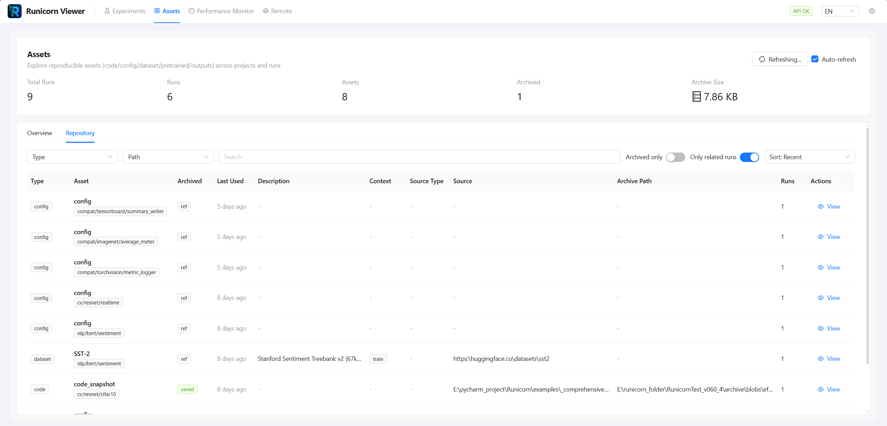
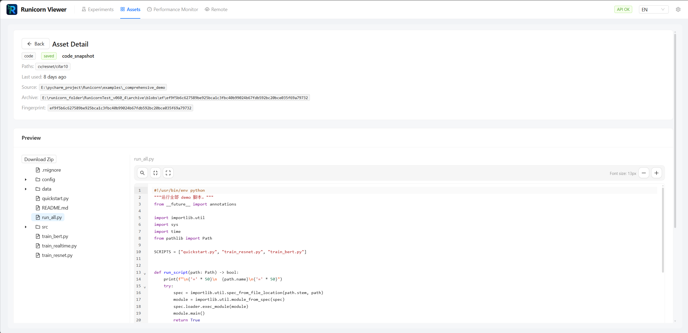

# Assets Page

The top-level **Assets** page is where you browse assets across runs, not just inside a single run detail view.

Use it when your question is about the whole storage root, for example:

- which paths are generating the most assets?
- which runs have archived code, datasets, or outputs?
- which asset is reused by multiple runs?
- which archived asset should I preview or download directly?

---

## What the page contains

The page has two main tabs:

- **Overview**
- **Repository**

At the top, it also shows storage-level stats such as:

- total runs
- runs with assets
- total asset count
- archived asset count
- archive size

<figure markdown>
  
  <figcaption>The Assets page is a storage-wide browser, not just a per-run attachment list.</figcaption>
</figure>

---

## Overview tab

The **Overview** tab groups asset usage by run path.

This is useful when you want to see:

- which paths have the most runs with assets
- how many archived assets each path contains
- the rough distribution of code/config/dataset/pretrained/output assets by path

Think of it as an operational summary rather than a file browser.

---

## Repository tab

The **Repository** tab is the detailed asset catalog.

Here you can filter and inspect assets by:

- kind
- path
- archived-only vs all
- related-only vs all
- search text
- sort mode

The table exposes information such as:

- asset kind
- display name
- whether the asset is archived or only referenced
- last used time
- description and context
- source type
- source URI
- archive path
- related run count

This is the best place to answer questions like “where is that snapshot?” or “which runs reuse this artifact?”.

---

## Asset detail page

From the Repository tab, you can open a dedicated asset detail page.

That page lets users inspect:

- identity and kind
- related paths
- description and context
- source and archive locations
- fingerprint
- preview content when supported
- which runs use the asset

<figure markdown>
  
  <figcaption>Asset detail pages can preview code and other text-like assets directly in the UI.</figcaption>
</figure>

---

## How this differs from the run detail Assets tab

The run detail **Assets** tab answers:

- what is attached to this one run?

The top-level **Assets** page answers:

- what assets exist across the whole storage root?
- how are they distributed across paths?
- which asset should I open directly without first opening a run?

So they are related, but they are not the same UI surface.

---

## Best use cases

- auditing code snapshots across many runs
- finding archived datasets or outputs without opening runs one by one
- checking which assets are shared across multiple runs
- jumping directly to preview and download flows

---

## Next steps

- [Run Detail Logs & Images](logs-assets-and-images.md)
- [Assets & Outputs](../sdk/assets-and-outputs.md)
- [Import, Export & Recycle Bin](import-export-recycle-bin.md)
