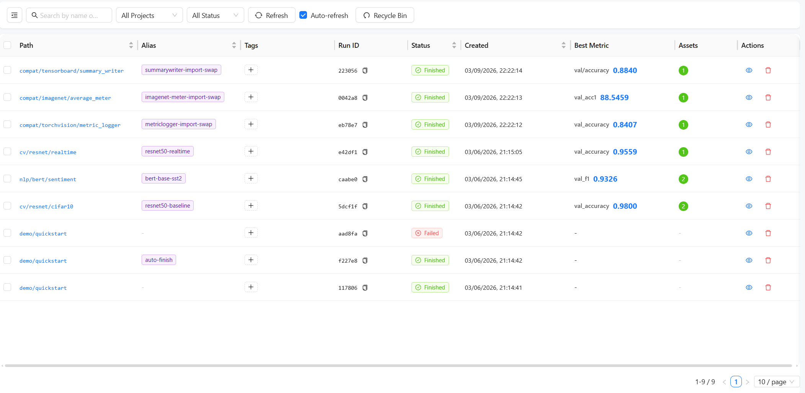
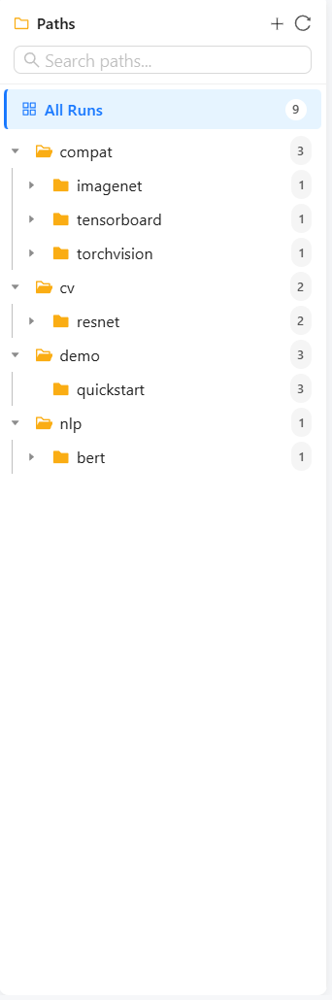
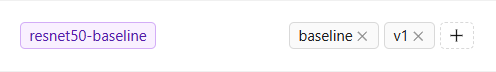

# Experiments & Paths

The experiments page is where most users spend their time. It combines the run table with a path tree for organization.

---

## Run table

The table is designed for scanning many runs quickly.

<figure markdown>
  
  <figcaption>The run table is the main place for scanning status, metrics, and batch actions.</figcaption>
</figure>

Common actions:

- search by text
- filter by status
- filter by selected path subtree
- edit aliases inline
- add and remove tags
- select multiple runs for batch actions

---

## Path tree actions

The current tree supports more than filtering:

- expand and collapse folders
- create folders
- delete folders into the recycle bin
- move runs by path
- batch export a subtree

<figure markdown>
  { width="260" }
  <figcaption>The path tree makes it easier to browse experiment groups and act on a whole subtree at once.</figcaption>
</figure>

For path naming strategy, hierarchy design, and migration from old `project/name`, see [Path-based Hierarchy](../reference/path-hierarchy.md).

---

## Alias and tags

Aliases help with readable labels in the table and compare mode. Tags help group runs across otherwise different paths.

<figure markdown>
  { width="520" }
  <figcaption>Aliases and tags are lightweight ways to keep related runs understandable without overloading the path hierarchy.</figcaption>
</figure>

Suggested usage:

- alias: `best-seed`, `ablation-a`, `resume-2`
- tags: `baseline`, `prod-candidate`, `long-run`

---

## Run detail entry points

From the experiments page you can usually move into:

- a single run detail page
- compare mode
- export flow
- recycle bin

---

## Next steps

- [Compare & Analysis](compare-and-analysis.md)
- [Import, Export & Recycle Bin](import-export-recycle-bin.md)
- [Quick Start](../getting-started/quickstart.md)
