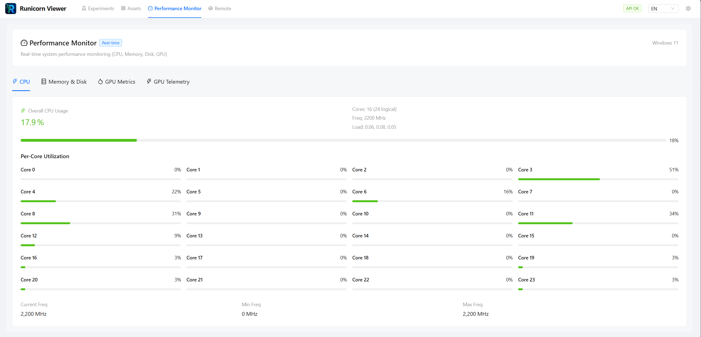

# GPU & Performance

The performance page now combines live system readings with longer-running GPU telemetry collected on the backend.

---

## What you can inspect

- CPU usage
- memory and disk activity
- current GPU metrics
- GPU telemetry history

<figure markdown>
  
  <figcaption>CPU and system panels give a quick view of local machine health.</figcaption>
</figure>

---

## GPU history

One of the more important changes in 0.7.0 is that GPU telemetry is no longer only a transient view. The backend can collect history over time so you can return to the page and still inspect recent GPU behavior.

<figure markdown>
  
  <figcaption>GPU telemetry history helps you inspect utilization trends over longer runs.</figcaption>
</figure>

---

## Settings that matter

The settings drawer can control:

- whether the GPU collector is enabled
- collection interval
- maximum history duration

Some of these settings may require a restart to fully take effect.

---

## Good use cases

- diagnosing GPU stalls
- checking utilization over long jobs
- comparing resource behavior before and after a training change

---

## Next steps

- [Settings & Themes](settings-and-themes.md)
- [Web UI Overview](overview.md)
- [Troubleshooting](../reference/troubleshooting.md)
