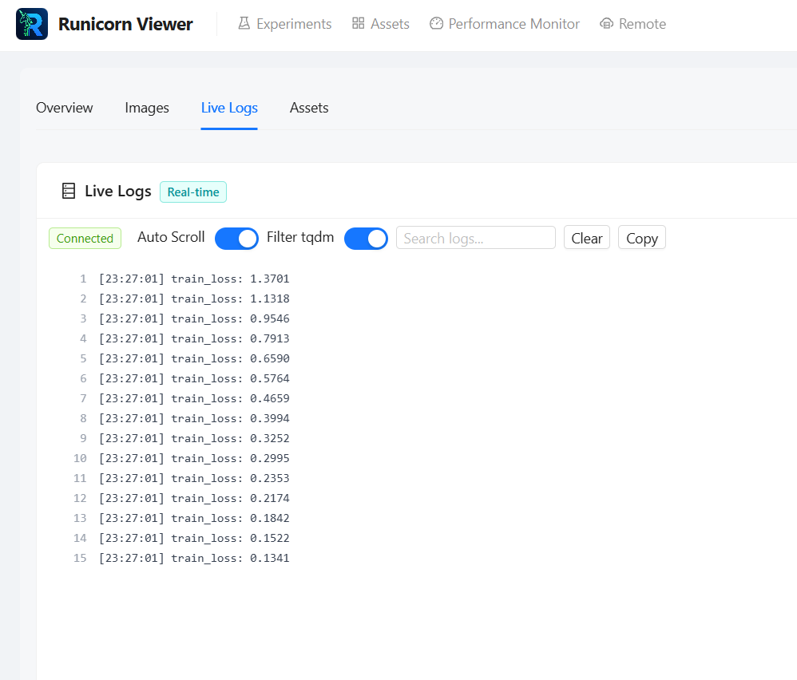
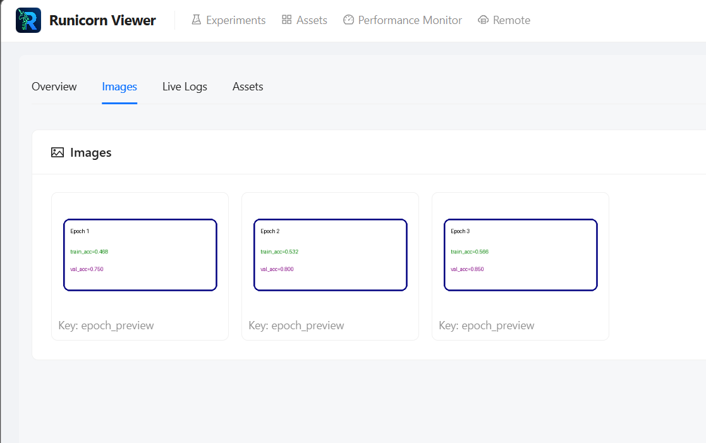

# Run Detail: Logs & Images

Runicorn's run detail page is no longer just a chart screen. The **Logs** and **Images** tabs are important day-to-day debugging surfaces, especially while training is still active.

---

## Logs

The current logs view is designed for long-running jobs:

- taller layout that uses more of the page
- timestamps for `run.log_text(...)`
- virtualized rendering for large logs
- auto-scroll that disengages when you scroll up
- a way to resume auto-scroll when you want to jump back to the live tail

This is especially useful for training jobs that produce thousands of lines.

<figure markdown>
  
  <figcaption>The logs tab is optimized for long-running jobs and large log files.</figcaption>
</figure>

---

## Images

Logged images appear in the run detail page when present.

Typical use cases:

- validation predictions
- sample batches
- segmentation overlays
- qualitative checkpoints

<figure markdown>
  
  <figcaption>Images logged through the SDK appear in the run detail page when available.</figcaption>
</figure>

---

## Assets in run detail

The run detail page also includes an **Assets** tab for things attached to the current run:

- code snapshots
- config metadata
- datasets
- pretrained references
- archived outputs

Use that tab when the question is:

- what belongs to this specific run?

Use the top-level [Assets Page](assets-page.md) when the question is:

- what assets exist across the whole storage root?
- which asset should I inspect directly?

---

## Next steps

- [Assets Page](assets-page.md)
- [Assets & Outputs](../sdk/assets-and-outputs.md)
- [Web UI Overview](overview.md)
- [Import, Export & Recycle Bin](import-export-recycle-bin.md)
- [Troubleshooting](../reference/troubleshooting.md)
