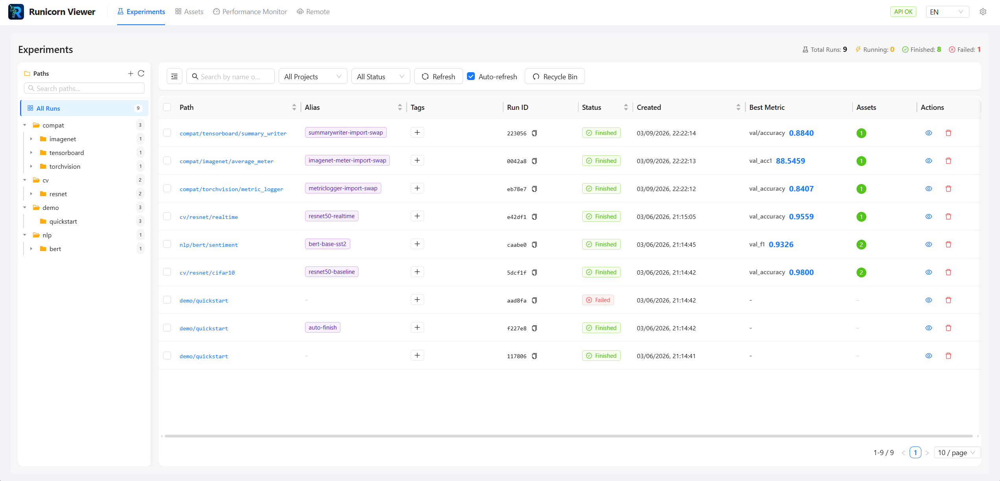
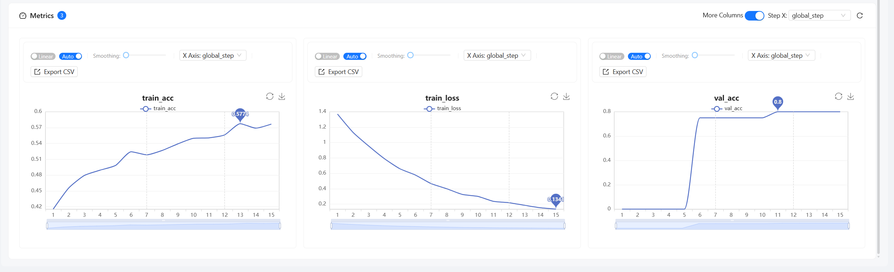
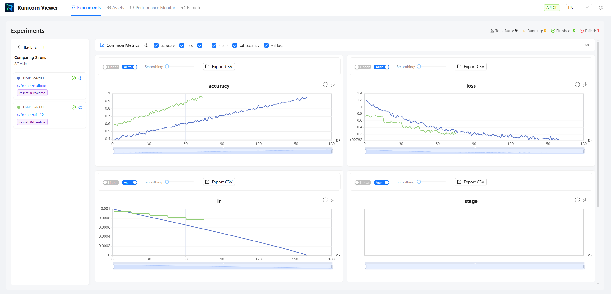
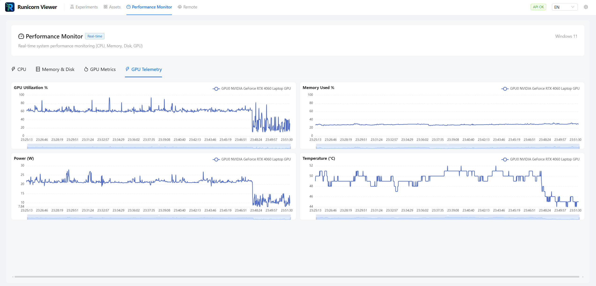

# Web UI Overview

Runicorn's current Web UI centers around four top-level areas: experiments, assets, performance, and remote sessions.

---

## Starting the viewer

```bash
runicorn viewer
```

Open [http://127.0.0.1:23300](http://127.0.0.1:23300) in your browser.

??? tip "Custom host and port"
    ```bash
    runicorn viewer --host 0.0.0.0 --port 8000
    ```

---

## Main navigation

The current app header exposes these primary pages:

- **Experiments**: the main run list, path tree, compare mode, and recycle-bin entry point
- **Assets**: cross-run asset browsing and preview
- **Performance**: system metrics and GPU telemetry history
- **Remote**: remote server profiles, active sessions, and security controls

See [Experiments & Paths](experiments-and-paths.md), [Compare & Analysis](compare-and-analysis.md), [Assets Page](assets-page.md), [Remote Viewer Page](remote-viewer-page.md), and [Import, Export & Recycle Bin](import-export-recycle-bin.md) for focused walkthroughs.

See [Experiments & Paths](experiments-and-paths.md), [Compare & Analysis](compare-and-analysis.md), and [Import, Export & Recycle Bin](import-export-recycle-bin.md) for focused walkthroughs.

---

## Experiments page

The experiments page is the daily dashboard for most users.

<figure markdown>
  
  <figcaption>The experiments page combines the main run table with the left-side path tree.</figcaption>
</figure>

| Column | Description |
|--------|-------------|
| Path | Experiment path hierarchy |
| Alias | Editable human-friendly label |
| Tags | Lightweight run classification |
| Status | Current status |
| Created | Creation timestamp |
| Duration | Total runtime |
| Best Metric | Primary metric value and step |

Key interactions:

- search and filter by path, status, alias, and tags
- open a run detail page
- multi-select runs for export or delete
- move runs through path-based organization
- open the recycle bin

---

## Run detail page

Run detail now uses a cleaner tab layout. The important tabs are:

- **Overview**: summary, charts, run timing, and main metadata
- **Images**: logged images if the run has any
- **Logs**: live or captured logs in a taller, more practical layout
- **Assets**: linked assets, snapshots, datasets, outputs, and downloads

<figure markdown>
  
  <figcaption>The overview tab centers on metric charts, summary fields, and run metadata.</figcaption>
</figure>

---

## Path tree and organization

The left path tree is no longer just a filter. In the current UI it is part of the main organization workflow.

You can use it to:

- browse path segments quickly
- create and remove folders
- move runs
- batch-export a subtree
- batch-delete into the recycle bin

---

## Compare mode

Compare mode is centered on the experiments page rather than hidden in a separate secondary flow.

<figure markdown>
  
  <figcaption>Compare multiple runs with synchronized charts.</figcaption>
</figure>

Current behavior highlights:

- compare state can live in the URL
- the compare panel shows run aliases and tags
- charts share linked hover and zoom behavior
- hover on one run can highlight the same run across charts

---

## Assets page

The dedicated Assets page helps you browse stored content across runs. This is especially useful when you rely on code snapshots, archived datasets, outputs, or pretrained references.

<figure markdown>
  
  <figcaption>The top-level Assets page helps you inspect stored content across runs.</figcaption>
</figure>

See [Assets Page](assets-page.md) for the full walkthrough.

---

## Performance page

The performance area now includes backend-collected GPU history instead of only a moment-in-time snapshot.

Expect to see:

- CPU
- memory and disk
- current GPU metrics
- GPU telemetry history

<figure markdown>
  
  <figcaption>The performance page combines live hardware readings with GPU telemetry history.</figcaption>
</figure>

---

## Settings

The settings drawer has been reorganized. Important sections now include:

- theme mode and accent color
- surface colors and background style
- compare tooltip preferences
- chart density and max point count
- experiment refresh cadence
- GPU collector settings
- dismissed alerts

---

## Mobile and responsive behavior

The current UI is more responsive than earlier versions, but it is still optimized for desktop. On smaller screens the path tree collapses more aggressively and navigation labels shrink.

---

## Next steps

- [Experiments & Paths](experiments-and-paths.md)
- [Compare & Analysis](compare-and-analysis.md)
- [Logs, Assets & Images](logs-assets-and-images.md)
- [Assets Page](assets-page.md)
- [Remote Viewer Page](remote-viewer-page.md)
- [Settings & Themes](settings-and-themes.md)
- [Remote Viewer Guide](../getting-started/remote-viewer.md)

---

<div class="rn-page-nav">
  <a href="experiments-and-paths.md">Experiments & Paths -></a> |
  <a href="settings-and-themes.md">Settings & Themes -></a>
</div>
