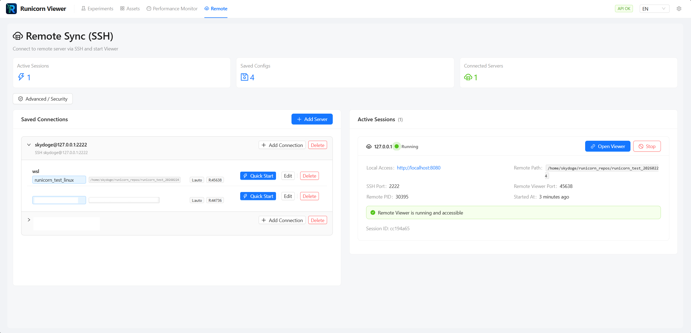
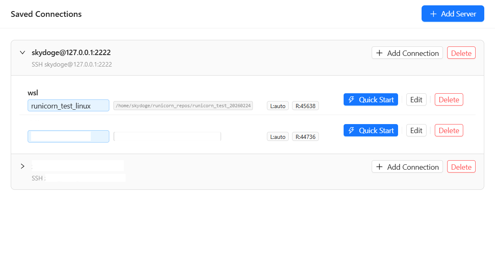
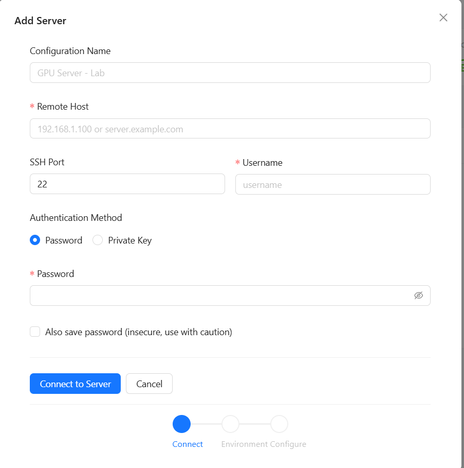
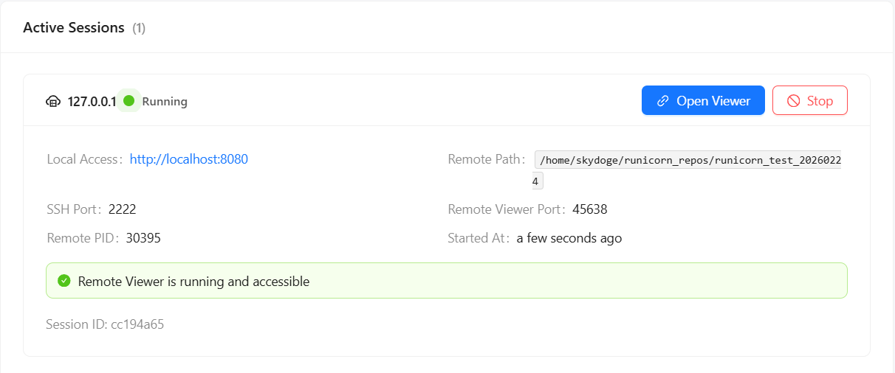

# Remote Viewer Page

The **Remote** page is the UI surface for connecting to remote machines, choosing Python environments, and managing active remote viewer sessions.

This page is different from the basic [Remote Viewer](../getting-started/remote-viewer.md) guide:

- the getting-started guide explains the remote workflow end to end
- this page explains the **Remote page itself** inside the Web UI

---

## What the page is for

Use the Remote page when you want to:

- save remote servers and connection profiles
- start a remote viewer session through the UI
- choose the Python environment on the remote machine
- inspect active sessions and their states
- manage host keys and related security metadata

<figure markdown>
  
  <figcaption>The Remote page brings saved connections, the setup wizard, and active session management into one screen.</figcaption>
</figure>

---

## Main parts of the page

The page usually revolves around four things:

1. saved servers
2. saved connection profiles
3. the connection / environment / config wizard
4. active remote sessions

In practice, this means you can configure a remote machine once and then reuse it instead of re-entering everything every time.

---

## Saved servers and profiles

The current UI separates:

- the server itself
- connection profiles attached to that server

That lets you reuse one machine with different:

- Python environments
- storage roots
- startup preferences

This is especially useful if one server is shared across multiple projects.

<figure markdown>
  
  <figcaption>Saved servers and connection profiles let you reuse one machine across multiple environments or workflows.</figcaption>
</figure>

---

## Connection wizard

The current Remote page uses a step-based wizard rather than a single long form.

Typical steps:

1. connect to the server
2. choose a detected environment
3. review configuration and start

This makes the flow easier to reason about than mixing SSH settings, environment detection, and startup options in one block.

<figure markdown>
  
  <figcaption>The connection wizard guides users through SSH connection, environment selection, and session startup.</figcaption>
</figure>

---

## Environment selection

After the SSH connection succeeds, the page can show detected environments such as:

- conda environments
- virtualenvs
- system Python

The UI is meant to help you pick the environment that already has Runicorn installed, rather than forcing you to remember paths manually.

---

## Active session cards

Once a remote session starts, the page shows it as a session card.

Those cards are where users usually:

- inspect session state
- stop a session
- see whether the session is healthy or reconnecting

States can include:

- `running`
- `reconnecting`
- `degraded`
- `disconnected`
- `stopped`

<figure markdown>
  
  <figcaption>Session cards are the main place to inspect state and stop or recover a remote session.</figcaption>
</figure>

---

## Security drawer and host keys

The Remote page also includes a security-oriented workflow around SSH host keys.

That means users can:

- confirm unknown host keys
- inspect known hosts
- remove stale host-key entries

This is an important part of the current Remote UI and should be understood as part of the page, not as hidden infrastructure.

---

## How this page relates to the rest of the UI

The Remote page is where sessions are started and managed.

After a session is up, users normally move back into the rest of the UI to:

- browse experiments
- inspect run detail pages
- compare runs
- inspect assets

So the Remote page is a session control surface, not the place where most analysis happens.

Once a remote session is opened, users are effectively looking at almost the same viewer interface they use locally. The difference is that the viewer process serving the data is running on the remote machine rather than on the local one.

---

## Best use cases

- connecting to a shared GPU machine
- reusing the same host with different environments
- keeping remote session management separate from experiment analysis
- inspecting which remote sessions are still active

---

## Next steps

- [Remote Viewer](../getting-started/remote-viewer.md)
- [Remote Workflow](../tutorials/remote-workflow.md)
- [Web UI Overview](overview.md)
